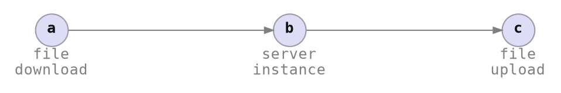

# Command Invocation



```rust ,ignore
let mut cmd_context = CmdContext::builder()
    .with_flow(&flow)
    .with_item_spec_params::<_>(..) // per item
    .with_output(&mut cli_output)
    .build();

StatusCmd::exec(&mut cmd_context).await?;
DeployCmd::exec(&mut cmd_context).await?;
```

That's nice, but:

```bash
envman init \
  --url https://example.com/app.tar \
  --image-id img-12345 \
  --instance-size xlarge

# yay!

# oh..
envman status \
  --url https://example.com/app.tar \
  --image-id img-12345 \
  --instance-size xlarge

envman deploy \
  --url https://example.com/app.tar \
  --image-id img-12345 \
  --instance-size xlarge
```

We need to store and reload the parameters passed in previously.
