# Command Invocation

```dot process
digraph {
    graph [
        margin    = 0.0
        penwidth  = 0
        nodesep   = 0.0
        ranksep   = 0.02
        bgcolor   = "transparent"
        fontname  = "helvetica"
        fontcolor = "#7f7f7f"
        rankdir   = LR
        // splines   = curved
    ]
    node [
        fontcolor = "#111111"
        fontname  = "monospace"
        fontsize  = 12
        shape     = "circle"
        style     = "filled"
        width     = 0.3
        height    = 0.3
        margin    = 0.04
        color     = "#9999aa"
        fillcolor = "#ddddf5"
    ]
    edge [
        arrowsize = 0.7
        color     = "#7f7f7f"
        fontcolor = "#7f7f7f"
    ]

    subgraph cluster_a {
        a [label = <<b>a</b>>]
        a_text [shape="plain" style="" fontcolor="#7f7f7f" label = <<table border="0" cellborder="0" cellpadding="0"><tr>
            <td><font point-size="15">📥</font></td>
            <td balign="left">file<br/>download</td>
        </tr></table>>]
    }

    subgraph cluster_b {
        b [label = <<b>b</b>>]
        b_text [shape="plain" style="" fontcolor="#7f7f7f" label = <<table border="0" cellborder="0" cellpadding="0"><tr>
            <td><font point-size="15">🪣</font></td>
            <td balign="left">s3<br/>bucket</td>
        </tr></table>>]
    }

    subgraph cluster_c {
        c [label = <<b>c</b>>]
        c_text [shape="plain" style="" fontcolor="#7f7f7f" label = <<table border="0" cellborder="0" cellpadding="0"><tr>
            <td><font point-size="15">📤</font></td>
            <td balign="left">s3<br/>object</td>
        </tr></table>>]
    }

    a -> b [minlen = 15, weight = 5]
    b -> c [minlen = 15, weight = 5]
}
```

<!--  -->



```rust ,ignore
// examples/envman/src/cmds/profile_init_cmd.rs
// fn app_upload_flow_init
let cmd_ctx = CmdCtxSpsf::builder
    ::<EnvManError, _>()
    .with_output(output)
    .with_workspace(workspace)
    .with_profile_from_workspace_param(profile_key)
    .with_flow(flow)
    .with_item_params::<FileDownloadItem<WebApp>>(
        item_id!("app_download"),
        app_download_params_spec,
    )
    .with_item_params::<S3BucketItem<WebApp>>(
        item_id!("s3_bucket"),
        s3_bucket_params_spec,
    )
    .with_item_params::<S3ObjectItem<WebApp>>(
        item_id!("s3_object"),
        s3_object_params_spec,
    )
    .await?;

// examples/envman/src/cmds/env_status_cmd.rs
// envman status
StatesCurrentReadCmd::exec(&mut cmd_ctx).await?;

// examples/envman/src/cmds/env_deploy_cmd.rs
// envman deploy
EnsureCmd::exec(&mut cmd_ctx).await?;
```
