# Flow Definition

* **Items:** Steps of a process.
* **Ordering:** Sequence between steps.

```dot process
digraph {
    graph [
        margin    = 0.0
        penwidth  = 0
        nodesep   = 0.0
        ranksep   = 0.02
        bgcolor   = "transparent"
        fontname  = "helvetica"
        fontcolor = "#7f7f7f"
        rankdir   = LR
    ]
    node [
        fontcolor = "#111111"
        fontname  = "monospace"
        fontsize  = 12
        shape     = "circle"
        style     = "filled"
        width     = 0.3
        height    = 0.3
        margin    = 0.04
        color     = "#9999aa"
        fillcolor = "#ddddf5"
    ]
    edge [
        arrowsize = 0.7
        color     = "#7f7f7f"
        fontcolor = "#7f7f7f"
    ]

    subgraph cluster_a {
        a [label = <<b>a</b>>]
        a_text [shape="plain" style="" fontcolor="#7f7f7f" label = <<table border="0" cellborder="0" cellpadding="0"><tr>
            <td><font point-size="15">📥</font></td>
            <td balign="left">file<br/>download</td>
        </tr></table>>]
    }

    subgraph cluster_b {
        b [label = <<b>b</b>>]
        b_text [shape="plain" style="" fontcolor="#7f7f7f" label = <<table border="0" cellborder="0" cellpadding="0"><tr>
            <td><font point-size="15">🪣</font></td>
            <td balign="left">s3<br/>bucket</td>
        </tr></table>>]
    }

    subgraph cluster_c {
        c [label = <<b>c</b>>]
        c_text [shape="plain" style="" fontcolor="#7f7f7f" label = <<table border="0" cellborder="0" cellpadding="0"><tr>
            <td><font point-size="15">📤</font></td>
            <td balign="left">s3<br/>object</td>
        </tr></table>>]
    }

    a -> b [minlen = 9]
    b -> c [minlen = 9]
}
```

<div class="centered_container" style="transform: scale(1.25);">



</div>

```rust ,ignore
// examples/envman/src/flows/app_upload_flow.rs
let flow = {
    let graph = {
        let mut graph_builder = ItemGraphBuilder::<EnvManError>::new();

        let [a, b, c] = graph_builder.add_fns([
            FileDownloadItem::<WebApp>::new(item_id!("app_download")).into(),
            S3BucketItem::<WebApp>::new(item_id!("s3_bucket")).into(),
            S3ObjectItem::<WebApp>::new(item_id!("s3_object")).into(),
        ]);

        graph_builder.add_edges([(a, b), (b, c)])?;
        graph_builder.build()
    };

    Flow::new(flow_id!("app_upload"), graph)
};
```

## Non-linear Ordering

```dot process
digraph {
    graph [
        margin    = 0.0
        penwidth  = 0
        nodesep   = 0.0
        ranksep   = 0.02
        bgcolor   = "transparent"
        fontname  = "helvetica"
        fontcolor = "#7f7f7f"
        rankdir   = LR
        splines   = line
    ]
    node [
        fontcolor = "#111111"
        fontname  = "monospace"
        fontsize  = 12
        shape     = "circle"
        style     = "filled"
        width     = 0.3
        height    = 0.3
        margin    = 0.04
        color     = "#9999aa"
        fillcolor = "#ddddf5"
    ]
    edge [
        arrowsize = 0.7
        color     = "#7f7f7f"
        fontcolor = "#7f7f7f"
    ]

    subgraph cluster_a {
        a [label = <<b>a</b>>]
        a_text [shape="plain" style="" fontcolor="#7f7f7f" label = <<table border="0" cellborder="0" cellpadding="0"><tr>
            <td><font point-size="15">📥</font></td>
            <td balign="left">file<br/>download</td>
        </tr></table>>]
    }

    subgraph cluster_b {
        b [label = <<b>b</b>>]
        b_text [shape="plain" style="" fontcolor="#7f7f7f" label = <<table border="0" cellborder="0" cellpadding="0"><tr>
            <td><font point-size="15">🪣</font></td>
            <td balign="left">s3<br/>bucket</td>
        </tr></table>>]
    }

    subgraph cluster_c {
        c [label = <<b>c</b>>]
        c_text [shape="plain" style="" fontcolor="#7f7f7f" label = <<table border="0" cellborder="0" cellpadding="0"><tr>
            <td><font point-size="15">📤</font></td>
            <td balign="left">s3<br/>object</td>
        </tr></table>>]
    }

    a -> c [minlen = 9]
    b -> c [minlen = 9]
}
```

<div class="centered_container" style="transform: scale(1.25);">



</div>

```diff
 graph_builder.add_edges([
-    (a, b),
+    (a, c),
     (b, c),
 ])?;
```
