# Imagining Automation

What does automation look like, from the perspective of an automation tool developer, or a workflow designer.

<details>
<summary>What is important to an automation tool developer</summary>

How can an automation tool developer provide value?

1. What does the automation do?

    1. Workflow steps.
    2. Ordering between steps.
    3. Data flow between steps.

2. How should it be presented to the user?

    1. Human or computer.
    2. Work role.

There are the concerns of an automation tool developer, and today we will look at how Peace supports the automation tool developer to ensure that:

* What is needed can be done
* What is needed can be done *easily*

Development / support / maintenance should not feel like a chore.

</details>

<details>
<summary></summary>

If I gave you a yaml file:

* How do you discover what to write?
* How can you be sure that you have written something correctly?
* How can you communicate with the user, how to recover from an error?

If, we can encode the information into a type-safe language, it would make many of these frustrations disappear.


## Values

```dot process
digraph {
    graph [
        margin    = 0.0
        penwidth  = 0
        nodesep   = 0.0
        ranksep   = 0.02
        bgcolor   = "transparent"
        fontname  = "helvetica"
        fontcolor = "#7f7f7f"
        rankdir   = LR
    ]
    node [
        fontcolor = "#111111"
        fontname  = "monospace"
        fontsize  = 12
        shape     = "circle"
        style     = "filled"
        width     = 0.3
        height    = 0.3
        margin    = 0.04
        color     = "#9999aa"
        fillcolor = "#ddddf5"
    ]
    edge [
        arrowsize = 0.7
        color     = "#7f7f7f"
        fontcolor = "#7f7f7f"
    ]

    subgraph cluster_a {
        subgraph cluster_a_params {
            a_params_src [
                label     = "src"
                margin    = 0.0
                fontsize  = 8
                width     = 0.36
                height    = 0.19
                shape     = "rectangle"
                style     = "filled,rounded"
                fillcolor = "#ffaaff"
                color     = "#773377"
            ]

            a_params_dest [
                label     = "dest"
                margin    = 0.0
                fontsize  = 8
                width     = 0.36
                height    = 0.19
                shape     = "rectangle"
                style     = "filled,rounded"
                fillcolor = "#ffaaff"
                color     = "#773377"
            ]

            a_state [
                margin   = 0.0
                fontsize = 9
                shape    = "none"
                style    = "filled,rounded"
                color    = "#667722"
                label    = <<table
                        style="rounded"
                        border="1"
                        cellborder="0"
                        cellpadding="1"
                        cellspacing="0"
                        bgcolor="#ffffaa"
                    >
                    <tr><td colspan="2"><font point-size="10"><b>FileState</b></font></td></tr>
                    <tr>
                        <td align="left" balign="left"><b>path:</b></td>
                        <td align="left" balign="left">/path/to/app</td>
                    </tr>
                    <tr>
                        <td align="left" balign="left"><b>md5:</b></td>
                        <td align="left" balign="left">ab12ef</td>
                    </tr>
                    <tr><td cellpadding="1"></td></tr>
                </table>>
            ]
        }

        a [label = <<b>a</b>>]
        a_text [shape="plain" style="" fontcolor="#7f7f7f" label = <file<br/>download>]

        a_params_src -> a_state [style = invis]
        a_params_dest -> a_state [style = invis]
        a -> a_state [color = "#44bb66", arrowhead = "vee"]
    }
    subgraph cluster_b {
        b [label = <<b>b</b>>]
        b_text [shape="plain" style="" fontcolor="#7f7f7f" label = <server<br/>instance>]

        subgraph cluster_b_params {
            b_params_image [
                label     = "image"
                margin    = 0.0
                fontsize  = 8
                width     = 0.36
                height    = 0.19
                shape     = "rectangle"
                style     = "filled,rounded"
                fillcolor = "#ffaaff"
                color     = "#773377"
            ]

            b_params_size [
                label     = "size"
                margin    = 0.0
                fontsize  = 8
                width     = 0.36
                height    = 0.19
                shape     = "rectangle"
                style     = "filled,rounded"
                fillcolor = "#ffaaff"
                color     = "#773377"
            ]

            b_state [
                margin   = 0.0
                fontsize = 9
                shape    = "none"
                style    = "filled,rounded"
                color    = "#667722"
                label    = <<table
                        style="rounded"
                        border="1"
                        cellborder="0"
                        cellpadding="1"
                        cellspacing="0"
                        bgcolor="#ffffaa"
                    >
                    <tr><td colspan="2"><font point-size="10"><b>Server</b></font></td></tr>
                    <tr>
                        <td align="left" balign="left"><b>id:</b></td>
                        <td align="left" balign="left">i-12345</td>
                    </tr>
                    <tr>
                        <td align="left" balign="left"><b>ip:</b></td>
                        <td align="left" balign="left">10.0.0.17</td>
                    </tr>
                    <tr><td cellpadding="1"></td></tr>
                </table>>
            ]
        }

        b_params_image -> b_state [style = invis]
        b_params_size -> b_state [style = invis]
        b -> b_state [color = "#44bb66", arrowhead = "vee"]
    }

    subgraph cluster_c {
        c [label = <<b>c</b>>]
        c_text [shape="plain" style="" fontcolor="#7f7f7f" label = <file<br/>upload>]

        subgraph cluster_c_params {
            c_params_src_path [
                label     = "src"
                margin    = 0.0
                fontsize  = 8
                width     = 0.36
                height    = 0.19
                shape     = "rectangle"
                style     = "filled,rounded"
                fillcolor = "#ffaaff"
                color     = "#773377"
            ]

            c_params_dest_ip [
                label     = "ip"
                margin    = 0.0
                fontsize  = 8
                width     = 0.36
                height    = 0.19
                shape     = "rectangle"
                style     = "filled,rounded"
                fillcolor = "#ffaaff"
                color     = "#773377"
            ]

            c_params_dest_path [
                label     = "path"
                margin    = 0.0
                fontsize  = 8
                width     = 0.36
                height    = 0.19
                shape     = "rectangle"
                style     = "filled,rounded"
                fillcolor = "#ffaaff"
                color     = "#773377"
            ]

            c_state [
                margin   = 0.0
                fontsize = 9
                shape    = "none"
                style    = "filled,rounded"
                color    = "#667722"
                label    = <<table
                        style="rounded"
                        border="1"
                        cellborder="0"
                        cellpadding="1"
                        cellspacing="0"
                        bgcolor="#ffffaa"
                    >
                    <tr><td colspan="2"><font point-size="10"><b>RemoteFile</b></font></td></tr>
                    <tr>
                        <td align="left" balign="left"><b>ip:</b></td>
                        <td align="left" balign="left">10.0.0.17</td>
                    </tr>
                    <tr>
                        <td align="left" balign="left"><b>path:</b></td>
                        <td align="left" balign="left">/opt/demo/app</td>
                    </tr>
                    <tr>
                        <td align="left" balign="left"><b>md5:</b></td>
                        <td align="left" balign="left">ab12ef</td>
                    </tr>
                    <tr><td cellpadding="1"></td></tr>
                </table>>
            ]
        }

        c_params_src_path -> c_state [style = invis]
        c_params_dest_ip -> c_state [style = invis]
        c_params_dest_path -> c_state [style = invis]
        c -> c_state [color = "#44bb66", arrowhead = "vee"]
    }

    a -> b [minlen = 9]
    b -> c [minlen = 9]
}
```



</details>

---

### Command Context

At the bottom of every page, we will be building up a `cmd_context`, which holds the information about a workflow. Different commands can be invoked with the `cmd_context` to gather information about the workflow.

```rust ,ignore
let mut cmd_context = CmdContext::builder()
    /* ?? */
    .build();

StatusCmd(&mut cmd_context).await?;
DeployCmd(&mut cmd_context).await?;
```
