# Inputs and Outputs

For items to be reusable, its inputs and outputs are API.

```dot process
digraph {
    graph [
        margin    = 0.0
        penwidth  = 0
        nodesep   = 0.0
        ranksep   = 0.02
        bgcolor   = "transparent"
        fontname  = "helvetica"
        fontcolor = "#7f7f7f"
        rankdir   = LR
    ]
    node [
        fontcolor = "#111111"
        fontname  = "monospace"
        fontsize  = 12
        shape     = "circle"
        style     = "filled"
        width     = 0.3
        height    = 0.3
        margin    = 0.04
        color     = "#9999aa"
        fillcolor = "#ddddf5"
    ]
    edge [
        arrowsize = 0.7
        color     = "#7f7f7f"
        fontcolor = "#7f7f7f"
    ]

    subgraph cluster_a {
        a [label = <<b>a</b>>]
        a_text [shape="plain" style="none" fontcolor="#7f7f7f" label = <file<br/>download>]

        subgraph cluster_a_params {
            a_params_src [
                label     = "src"
                margin    = 0.0
                fontsize  = 8
                width     = 0.36
                height    = 0.19
                shape     = "rectangle"
                style     = "filled,rounded"
                fillcolor = "#ffaaff"
                color     = "#773377"
            ]

            a_params_dest [
                label     = "dest"
                margin    = 0.0
                fontsize  = 8
                width     = 0.36
                height    = 0.19
                shape     = "rectangle"
                style     = "filled,rounded"
                fillcolor = "#ffaaff"
                color     = "#773377"
            ]

            a_state [
                margin   = 0.0
                fontsize = 8
                shape    = "none"
                style    = "filled,rounded"
                color    = "#667722"
                label    = <<table
                        style="rounded"
                        border="1"
                        cellborder="0"
                        cellpadding="1"
                        cellspacing="0"
                        bgcolor="#ffffaa"
                    >
                    <tr><td colspan="2"><b>FileState</b></td></tr>
                    <tr>
                        <td align="left" balign="left"><b>path:</b></td>
                        <td align="left" balign="left">PathBuf</td>
                    </tr>
                    <tr>
                        <td align="left" balign="left"><b>md5:</b></td>
                        <td align="left" balign="left">Md5Sum</td>
                    </tr>
                    <tr><td cellpadding="1"></td></tr>
                </table>>
            ]
        }

        a_params_src -> a_state [style = invis]
        a_params_dest -> a_state [style = invis]
        a -> a_state [style = invis]
    }

    subgraph cluster_b {
        b [label = <<b>b</b>>]
        b_text [shape="plain" style="none" fontcolor="#7f7f7f" label = <server<br/>instance>]

        subgraph cluster_b_params {
            b_params_image [
                label     = "image"
                margin    = 0.0
                fontsize  = 8
                width     = 0.36
                height    = 0.19
                shape     = "rectangle"
                style     = "filled,rounded"
                fillcolor = "#ffaaff"
                color     = "#773377"
            ]

            b_params_size [
                label     = "size"
                margin    = 0.0
                fontsize  = 8
                width     = 0.36
                height    = 0.19
                shape     = "rectangle"
                style     = "filled,rounded"
                fillcolor = "#ffaaff"
                color     = "#773377"
            ]

            b_state [
                margin   = 0.0
                fontsize = 8
                shape    = "none"
                style    = "filled,rounded"
                color    = "#667722"
                label    = <<table
                        style="rounded"
                        border="1"
                        cellborder="0"
                        cellpadding="1"
                        cellspacing="0"
                        bgcolor="#ffffaa"
                    >
                    <tr><td colspan="2"><b>Server</b></td></tr>
                    <tr>
                        <td align="left" balign="left"><b>image:</b></td>
                        <td align="left" balign="left">ImageId</td>
                    </tr>
                    <tr>
                        <td align="left" balign="left"><b>id:</b></td>
                        <td align="left" balign="left">InstId</td>
                    </tr>
                    <tr>
                        <td align="left" balign="left"><b>ip:</b></td>
                        <td align="left" balign="left">IpAddr</td>
                    </tr>
                    <tr><td cellpadding="1"></td></tr>
                </table>>
            ]
        }

        b_params_image -> b_state [style = invis]
        b_params_size -> b_state [style = invis]
        b -> b_state [style = invis]
    }

    subgraph cluster_c {
        c [label = <<b>c</b>>]
        c_text [shape="plain" style="none" fontcolor="#7f7f7f" label = <file<br/>upload>]

        subgraph cluster_c_params {
            c_params_src_path [
                label     = "src"
                margin    = 0.0
                fontsize  = 8
                width     = 0.36
                height    = 0.19
                shape     = "rectangle"
                style     = "filled,rounded"
                fillcolor = "#ffaaff"
                color     = "#773377"
            ]

            c_params_dest_ip [
                label     = "ip"
                margin    = 0.0
                fontsize  = 8
                width     = 0.36
                height    = 0.19
                shape     = "rectangle"
                style     = "filled,rounded"
                fillcolor = "#ffaaff"
                color     = "#773377"
            ]

            c_params_dest_path [
                label     = "path"
                margin    = 0.0
                fontsize  = 8
                width     = 0.36
                height    = 0.19
                shape     = "rectangle"
                style     = "filled,rounded"
                fillcolor = "#ffaaff"
                color     = "#773377"
            ]

            c_state [
                margin   = 0.0
                fontsize = 8
                shape    = "none"
                style    = "filled,rounded"
                color    = "#667722"
                label    = <<table
                        style="rounded"
                        border="1"
                        cellborder="0"
                        cellpadding="1"
                        cellspacing="0"
                        bgcolor="#ffffaa"
                    >
                    <tr><td colspan="2"><b>RemoteFile</b></td></tr>
                    <tr>
                        <td align="left" balign="left"><b>ip:</b></td>
                        <td align="left" balign="left">IpAddr</td>
                    </tr>
                    <tr>
                        <td align="left" balign="left"><b>path:</b></td>
                        <td align="left" balign="left">PathBuf</td>
                    </tr>
                    <tr>
                        <td align="left" balign="left"><b>md5:</b></td>
                        <td align="left" balign="left">Md5Sum</td>
                    </tr>
                    <tr><td cellpadding="1"></td></tr>
                </table>>
            ]
        }

        c_params_src_path -> c_state [style = invis]
        c_params_dest_ip -> c_state [style = invis]
        c_params_dest_path -> c_state [style = invis]
        c -> c_state [style = invis]
    }

    a -> b [minlen = 9]
    b -> c [minlen = 9]
}
```



### Item Spec API

```rust ,ignore
impl<Id> ItemSpec for FileDownloadItemSpec<Id>
{
    type Params<'exec> = FileDownloadParams<Id>;
    type State = FileDownloadState;
    // ..
}
```

<div class="column_half">

Input:

```rust ,ignore
pub struct FileDownloadParams<Id> {
    src: Url,
    dest: PathBuf,
    marker: PhantomData<Id>,
}


```

</div><div class="column_half">

Output:

```rust ,ignore
pub enum FileDownloadState {
    None,
    Some {
        path: PathBuf,
        md5: Md5Sum,
    },
}
```

</div>
