# Output and Presentation

When the workflow is defined, we want to interact with it in different ways.

## Presentation

### Command Line Interface

<pre class="terminal">
<span class='shell'>&gt; </span><span class='cmd'>./envman</span> <span class='arg'>deploy</span>
Using profile <span style='color:#ffafff'><b>⦗demo⦘</b></span> -- type <span style='color:#5fafff'>`development`</span>

✅ <span style='color:#fff'>1.</span> <span style='color:#5fafff'>app_download</span> <span style='color:#00af5f00; background-color:#00af5f' class="shell_progress_bar">▰▰▰▰▰▰▰▰▰▰▰▰▰▰▰▰▰▰▰▰▰▰▰▰▰▰▰▰▰▰▰▰▰▰▰▰▰▰▰▰</span> done!
⏳ <span style='color:#fff'>2.</span> <span style='color:#5fafff'>s3_bucket</span>    <span style='color:#0087d700; background-color:#0087d7' class="shell_progress_bar">▰▰▰▰▰▰▰▰▰▰▰▰▰▰▰▰▰▰▰▰▱▱▱▱▱▱▱▱▱▱▱▱▱▱▱▱▱▱▱▱</span> 0/1 creating bucket <span style='color:#af00d7'>(el: 6s, eta: 0s)</span>
⏳ <span style='color:#fff'>3.</span> <span style='color:#5fafff'>s3_object</span>    <span style='color:#555'>▱▱▱▱▱▱▱▱▱▱▱▱▱▱▱▱▱▱▱▱▱▱▱▱▱▱▱▱▱▱▱▱▱▱▱▱▱▱▱▱</span> <span style='color:#af00d7'>(el: 0s, eta: 0s)</span>
</pre>


### Continuous Integration

```text
2023-05-07T01:30:31.135Z | app_download | downloaded at /tmp/.a9efb2/web_app.tar
2023-05-07T01:30:31.754Z | s3_bucket    | creating bucket
2023-05-07T01:30:32.687Z | s3_bucket    | bucket created
```


### Web API

```json
// GET /api/v1/demo/env_deploy/progress
{
    "item_id": "s3_bucket",
    "progress_update": { "Delta": "Tick" },
    "msg_update": { "Set": "creating bucket" }
    // ..
}
```


### Web page

```dot process
digraph {
    graph [
        margin    = 0.0
        penwidth  = 0
        nodesep   = 0.0
        ranksep   = 0.02
        bgcolor   = "transparent"
        fontname  = "helvetica"
        fontcolor = "#7f7f7f"
        rankdir   = TB
        splines   = line
    ]
    node [
        fontcolor = "#111111"
        fontname  = "monospace"
        fontsize  = 12
        shape     = "circle"
        style     = "filled"
        width     = 0.3
        height    = 0.3
        margin    = 0.04
        color     = "#9999aa"
        fillcolor = "#ddddf5"
        penwidth  = 2
    ]
    edge [
        arrowsize = 0.7
        color     = "#7f7f7f"
        fontcolor = "#7f7f7f"
        penwidth  = 2
    ]

    subgraph cluster_a {
        node [color="#449966" fillcolor="#99dd99"]
        a [label = <<b>a</b>>]
        a_text [shape="plain" style="" fontcolor="#7f7f7f" label = <<table border="0" cellborder="0" cellpadding="0"><tr>
            <td><font point-size="15">📥</font></td>
            <td balign="left">file<br/>download</td>
        </tr></table>>]
        a -> a_text [style = invis]
    }

    subgraph cluster_b {
        node [color="#446699" fillcolor="#99aaee"]
        b [label = <<b>b</b>> class="item_b_in_progress" style="dashed,filled"]
        b_text [shape="plain" style="" fontcolor="#7f7f7f" label = <<table border="0" cellborder="0" cellpadding="0"><tr>
            <td><font point-size="15">🪣</font></td>
            <td balign="left">s3<br/>bucket</td>
        </tr></table>>]
        b -> b_text [style = invis]
    }

    subgraph cluster_c {
        c [label = <<b>c</b>>]
        c_text [shape="plain" style="" fontcolor="#7f7f7f" label = <<table border="0" cellborder="0" cellpadding="0"><tr>
            <td><font point-size="15">📤</font></td>
            <td balign="left">s3<br/>object</td>
        </tr></table>>]
        c -> c_text [style = invis]
    }

    a_text -> c [minlen = 9, color="#66aa66"]
    b_text -> c [minlen = 9, color="#6688bb"]
}
```

<div class="column_half">



</div><div class="column_half">

<div class="peace_button_container">
    <div class="peace_button">
        <div class="peace_button_label">Current<br/>State</div>
    </div>
    <div class="peace_button peace_button_left peace_button_running">
        <div class="peace_button_label">Deploy<br/>(preview)</div>
    </div>
    <div class="peace_button peace_button_right peace_button_running">
        <div class="peace_button_label"><div class="peace_button_spinner"></div></div>
    </div>
    <div class="peace_button peace_button_left">
        <div class="peace_button_label">Clean<br/>(preview)</div>
    </div>
    <div class="peace_button peace_button_right">
        <div class="peace_button_label">&#9654;</div>
    </div>
</div>

</div>


```rust ,ignore
// outputs to CLI
let mut output = CliOutput::new();

// === Used in tests === //
// discards all output
let mut output = NoOpOutput;

// records which output functions were called
// and what parameters they were called with
let mut output = FnTrackerOutput::new();

// === Write your own === //
// writes JSON to HTTP response
let mut output = JsonResponseOutput::new();
```


<style type="text/css">
.peace_button_container {
    display: flex;
    flex-direction: row;
}
.peace_button {
    background: linear-gradient(0deg, #ddddee, #eeeeff);
    border: 1px solid #9999aa;
    border-radius: 3px;
    padding: 0.3em 0.7em;
    font-size: 0.8em;
    font-weight: 550;
    text-align: center;
    flex-grow: 1;
    flex-shrink: 1;
    flex-basis: auto;
    cursor: pointer;
    /**/
    display: flex;
    align-items: center;
    justify-content: center;
}
.peace_button:hover {
    background: linear-gradient(0deg, #eeeeff, #fafaff);
    border: 1px solid #bbbbcc;
}
.peace_button:active {
    background: linear-gradient(0deg, #d0d0e0, #e0e0f0);
    border: 1px solid #9090a0;
}
.peace_button_running,
.peace_button_running:hover,
.peace_button_running:active {
    /* background: linear-gradient(0deg, #aaaaee, #ccccff); */
    background-color: #aabbf0;
    background-image: none; /* disables gradient */
    color: #0022558f;
    border: 1px solid #7070c0;
}
.peace_button_label {
    flex-grow: 1;
    flex-shrink: 1;
    flex-basis: auto;
}
.peace_button_left,
.peace_button_left:hover,
.peace_button_left:active {
    border-bottom-right-radius: 0px;
    border-top-right-radius: 0px;
}
.peace_button_right,
.peace_button_right:hover,
.peace_button_right:active {
    border-left: 0px;
    border-bottom-left-radius: 0px;
    border-top-left-radius: 0px;
}
.peace_button_spinner {
    display: inline-block;
    vertical-align: text-bottom;
    border: 2px solid transparent;
    background-clip: border-box, content-box;
    background-image: conic-gradient(#0022551f, #002255ff), conic-gradient(#aabbf0ff, #aabbf0ff);
    background-size: 100%;
    background-origin: border-box, content-box;
    background-blend-mode: screen;
    border-radius: 50%;
    width: 1em;
    height: 1em;
    animation: 3.0s linear forwards 0.0s infinite peace_button_spinner;
}
@keyframes peace_button_spinner {
    0% {
        transform: rotate(0deg);
    }
    100% {
        transform: rotate(360deg);
    }
}
.item_b_in_progress ellipse {
    animation: 10.0s linear forwards 0.0s infinite item_b_in_progress;
}
@keyframes item_b_in_progress {
    0% {
        transform-origin: 131px -204.31px;
/*        transform-origin: attr(cx px) attr(cy px);*/
        transform: rotate(0deg);
    }
    100% {
        transform-origin: 131px -204.31px;
/*        transform-origin: attr(cx px) attr(cy px);*/
        transform: rotate(360deg);
    }
}
.shell_progress_bar {
    background-repeat: no-repeat;
    background-blend-mode: lighten;
    background-clip: text;
    background-size: 50px;
    text-fill-color: transparent;
    animation: 2.5s linear forwards 1.0s infinite shell_progress_bar;
}
@keyframes shell_progress_bar {
    0% {
        background-position-x: left;
        background-image: linear-gradient(90deg, #000000 0%, #ffffffff 90%, #000000 100%);
    }
    30% {
        background-position-x: right;
        background-image: linear-gradient(90deg, #000000 0%, #ffffffff 90%, #000000 100%);
    }
    31% {
        background-position-x: right;
        background-image: linear-gradient(90deg, #000000 0%, #000000 100%);
    }
}
</style>
