# Parameters Specification

Specify *where to get the value* for each item's input.

The value may not necessarily exist until the flow is executed.

```dot process
digraph {
    graph [
        margin    = 0.0
        penwidth  = 0
        nodesep   = 0.0
        ranksep   = 0.02
        bgcolor   = "transparent"
        fontname  = "helvetica"
        fontcolor = "#7f7f7f"
        rankdir   = LR
        // splines   = curved
    ]
    node [
        fontcolor = "#111111"
        fontname  = "monospace"
        fontsize  = 12
        shape     = "circle"
        style     = "filled"
        width     = 0.3
        height    = 0.3
        margin    = 0.04
        color     = "#9999aa"
        fillcolor = "#ddddf5"
    ]
    edge [
        arrowsize = 0.7
        color     = "#7f7f7f"
        fontcolor = "#7f7f7f"
    ]

    subgraph cluster_a {
        a [label = <<b>a</b>>]
        a_text [shape="plain" style="" fontcolor="#7f7f7f" label = <<table border="0" cellborder="0" cellpadding="0"><tr>
            <td><font point-size="15">📥</font></td>
            <td balign="left">file<br/>download</td>
        </tr></table>>]

        subgraph cluster_a_params {
            a_params_src [
                label     = "src"
                margin    = 0.0
                fontsize  = 8
                width     = 0.78
                height    = 0.19
                shape     = "rectangle"
                style     = "filled,rounded"
                fillcolor = "#ffaaff"
                color     = "#773377"
            ]

            a_params_dest [
                label     = "dest"
                margin    = 0.0
                fontsize  = 8
                width     = 0.78
                height    = 0.19
                shape     = "rectangle"
                style     = "filled,rounded"
                fillcolor = "#ffaaff"
                color     = "#773377"
            ]

            a_state [
                label     = <&nbsp;..&nbsp;<br align="left"/>>
                margin    = 0.05
                fontsize  = 8
                shape     = "rectangle"
                style     = "filled,rounded"
                fillcolor = "#ffffaa"
                color     = "#667722"
            ]

        }

        a_params_src -> a_state [style = invis]
        a_params_dest -> a_state [style = invis]
        a -> a_state [style = invis]
    }

    subgraph cluster_b {
        b [label = <<b>b</b>>]
        b_text [shape="plain" style="" fontcolor="#7f7f7f" label = <<table border="0" cellborder="0" cellpadding="0"><tr>
            <td><font point-size="15">🪣</font></td>
            <td balign="left">s3<br/>bucket</td>
        </tr></table>>]

        subgraph cluster_b_params {
            b_params_name [
                label     = "name"
                margin    = 0.0
                fontsize  = 8
                width     = 0.78
                height    = 0.19
                shape     = "rectangle"
                style     = "filled,rounded"
                fillcolor = "#ffaaff"
                color     = "#773377"
            ]

            b_state [
                label     = <<b>S3BucketState</b>&nbsp;<br align="left"/>&nbsp;&nbsp;name<br align="left"/>>
                margin    = 0.05
                fontsize  = 8
                shape     = "rectangle"
                style     = "filled,rounded"
                fillcolor = "#ffffaa"
                color     = "#667722"
            ]
        }

        b_params_name -> b_state [style = invis]
        b -> b_state [style = invis]
    }

    subgraph cluster_c {
        c [label = <<b>c</b>>]
        c_text [shape="plain" style="" fontcolor="#7f7f7f" label = <<table border="0" cellborder="0" cellpadding="0"><tr>
            <td><font point-size="15">📤</font></td>
            <td balign="left">s3<br/>object</td>
        </tr></table>>]

        subgraph cluster_c_params {
            c_params_file_path [
                label     = "file_path"
                margin    = 0.0
                fontsize  = 8
                width     = 0.78
                height    = 0.19
                shape     = "rectangle"
                style     = "filled,rounded"
                fillcolor = "#ffaaff"
                color     = "#773377"
            ]

            c_params_bucket_name [
                label     = "bucket_name"
                margin    = 0.0
                fontsize  = 8
                width     = 0.78
                height    = 0.19
                shape     = "rectangle"
                style     = "filled,rounded"
                fillcolor = "#ffaaff"
                color     = "#773377"
            ]

            c_params_object_key [
                label     = "object_key"
                margin    = 0.0
                fontsize  = 8
                width     = 0.78
                height    = 0.19
                shape     = "rectangle"
                style     = "filled,rounded"
                fillcolor = "#ffaaff"
                color     = "#773377"
            ]

            c_state [
                label     = <&nbsp;..&nbsp;<br align="left"/>>
                margin    = 0.05
                fontsize  = 8
                shape     = "rectangle"
                style     = "filled,rounded"
                fillcolor = "#ffffaa"
                color     = "#667722"
            ]
        }

        c_params_file_path -> c_state [style = invis]
        c_params_bucket_name -> c_state [style = invis]
        c_params_object_key -> c_state [style = invis]
        c -> c_state [style = invis]
    }

    a -> b [minlen = 9, weight = 5]
    b -> c [minlen = 9, weight = 5]

    subgraph params {
        label = "Pre-execution\nknown values"
        cluster = false

        node [
            shape    = none
            fontsize = 8
            margin   = 0.05
            height    = 0.1
            style    = ""
        ]
        edge [
            color     = "#4455ff"
            arrowhead = "vee"
            style     = dashed
        ]

        web_app_url;
        web_app_path;
        bucket_name;
        object_key;

        web_app_url -> a_params_src [constraint = true]
        web_app_path -> a_params_dest [constraint = true]

        {
            edge [
                color     = "#cc7744"
            ]
            bucket_name -> b_params_name [constraint = true, minlen = 10]
        }

        {
            edge [
                color     = "#449988"
            ]
            a_state -> c_params_file_path [constraint = false, style = invis]
            b_state -> c_params_bucket_name [constraint = true]
        }
        web_app_path -> c_params_file_path [constraint = true, color = "#44dd77", minlen = 19]
        object_key -> c_params_object_key [constraint = true, color = "#44dd77", minlen = 19]
    }
}
```



```rust ,ignore
let app_download_params = FileDownloadParams::<WebApp> {
    src: Url::parse("https://example.com/web_app.tar")?,
    dest: PathBuf::from("/tmp/path/to/web_app.tar"),
    marker: PhantomData,
};

let s3_bucket_params = S3BucketParams::<WebApp>::new(bucket_name);

let s3_object_params = S3ObjectParams::<WebApp> {
    file_path: PathBuf::from("/tmp/path/to/web_app.tar"),
    object_key: String::from("web_app.tar"),
    bucket_name: !?, /* Somehow get the bucket name from `b` */
};
```

## Deferred Values

```rust ,ignore
// examples/envman/src/flows/app_upload_flow.rs
let s3_object_params_spec = S3ObjectParams::<WebApp>::field_wise_spec()
    .with_file_path(PathBuf::from("/tmp/path/to/web_app.tar"))
    .with_object_key(String::from("web_app.tar"))
    .with_bucket_name_from_map(|s3_bucket_state: &S3BucketState| {
        match s3_bucket_state {
            S3BucketState::None => None,
            S3BucketState::Some {
                name,
                creation_date: _,
            } => Some(name.clone()), // type safe!
        }
    })
    .build();
#
# let file_download_params_spec = file_download_params.into();
# let server_instance_params_spec = server_instance_params.into();
```
