# Scenario

```dot process
digraph {
    graph [
        margin    = 0.0
        penwidth  = 0
        nodesep   = 0.0
        ranksep   = 0.02
        bgcolor   = "transparent"
        fontname  = "helvetica"
        fontcolor = "#7f7f7f"
        rankdir   = LR
    ]
    node [
        fontcolor = "#111111"
        fontname  = "monospace"
        fontsize  = 12
        shape     = "circle"
        style     = "filled"
        width     = 0.3
        height    = 0.3
        margin    = 0.04
        color     = "#9999aa"
        fillcolor = "#ddddf5"
    ]
    edge [
        arrowsize = 0.7
        color     = "#7f7f7f"
        fontcolor = "#7f7f7f"
    ]

    subgraph cluster_a {
        a [label = <<b>a</b>>]
        a_text [shape="plain" style="" fontcolor="#7f7f7f" label = <<table border="0" cellborder="0" cellpadding="0"><tr>
            <td><font point-size="15">📥</font></td>
            <td balign="left">file<br/>download</td>
        </tr></table>>]
    }

    subgraph cluster_b {
        b [label = <<b>b</b>>]
        b_text [shape="plain" style="" fontcolor="#7f7f7f" label = <<table border="0" cellborder="0" cellpadding="0"><tr>
            <td><font point-size="15">🪣</font></td>
            <td balign="left">s3<br/>bucket</td>
        </tr></table>>]
    }

    subgraph cluster_c {
        c [label = <<b>c</b>>]
        c_text [shape="plain" style="" fontcolor="#7f7f7f" label = <<table border="0" cellborder="0" cellpadding="0"><tr>
            <td><font point-size="15">📤</font></td>
            <td balign="left">s3<br/>object</td>
        </tr></table>>]
    }

    a -> b [minlen = 9]
    b -> c [minlen = 9]
}
```

<div class="centered_container" style="transform: scale(1.25);">



</div>

## Shell Script

```bash
bucket_name='azriel-peace-demo-bash'
file_path='web_app.tar'
object_key='web_app.tar'

curl --fail \
  -o "${file_path}" \
  --location \
  https://github.com/azriel91/web_app/releases/download/0.1.1/web_app.tar

aws s3api create-bucket \
  --bucket "${bucket_name}" \
  --acl private \
  --create-bucket-configuration LocationConstraint=ap-southeast-2 |
  bat -l json

aws s3api put-object \
  --bucket "${bucket_name}" \
  --key "${object_key}" \
  --body "${file_path}" |
  bat -l json
```

```bash
aws s3api delete-object \
  --bucket "${bucket_name}" \
  --key "${object_key}" |
  bat -l json

aws s3api delete-bucket --bucket "${bucket_name}" | bat -l json

rm -f "${file_path}"
```

<div class="presentation_notes">

What does automation look like, from the perspective of an automation tool developer, or a workflow designer.

* Clarity between concept and code.
* Easy to write.
* Fast feedback when developing automation.
* Provide good UX without needing to write UI code.

---

### Command Context

At the bottom of every page, we will be building up a `cmd_context`, which holds the information about a workflow. Different commands can be invoked with the `cmd_context` to gather information about the workflow.

```rust ,ignore
let mut cmd_context = CmdContext::builder()
    /* ?? */
    .build();

StatusCmd(&mut cmd_context).await?;
DeployCmd(&mut cmd_context).await?;
```

</div>
