```dot process
digraph {
    graph [
        penwidth  = 0
        nodesep   = 0.5
        ranksep   = 0.4
        bgcolor   = "transparent"
        fontcolor = "#555555"
        splines   = line
        rankdir   = LR
    ]
    node [
        fontcolor = "#111111"
        fontname  = "monospace"
        fontsize  = 10
        shape     = "circle"
        style     = "filled"
        width     = 0.4
        height    = 0.4
        margin    = 0.04
        color     = "#aaaabb"
        fillcolor = "#eeeef5"
    ]
    edge [
        arrowsize = 0.7
        color     = "#555555"
        fontcolor = "#555555"
    ]
    start [
        label  = ""
        width  = 0.1
        height = 0.1
    ]
    end [
        label  = ""
        width  = 0.1
        height = 0.1
    ]
    b1 [color = "#88ffbb", fillcolor = "#bbffdd"]
    b2 [color = "#ff8888", fillcolor = "#ffbbbb"]
    b3 [color = "#88ffbb", fillcolor = "#bbffdd"]
    start -> b1 -> end
    start -> b2 -> end
    start -> b3 -> end
}
```

```dot process
digraph {
    graph [
        penwidth  = 0
        nodesep   = 0.5
        ranksep   = 0.4
        bgcolor   = "transparent"
        fontcolor = "#555555"
        splines   = line
        rankdir   = LR
    ]
    node [
        fontcolor = "#111111"
        fontname  = "monospace"
        fontsize  = 10
        shape     = "circle"
        style     = "filled"
        width     = 0.4
        height    = 0.4
        margin    = 0.04
        color     = "#aaaabb"
        fillcolor = "#eeeef5"
    ]
    edge [
        arrowsize = 0.7
        color     = "#555555"
        fontcolor = "#555555"
    ]
    start [
        label  = ""
        width  = 0.1
        height = 0.1
    ]
    end [
        label  = ""
        width  = 0.1
        height = 0.1
    ]
    b1 [color = "#88ffbb", fillcolor = "#bbffdd"]
    b2 [color = "#ff8888", fillcolor = "#ffbbbb"]
    b3 [color = "#ff8888", fillcolor = "#ffbbbb"]
    start -> b1 -> end
    start -> b2 -> end
    start -> b3 -> end
}
```

# User Facing Automation - Part 1

## Set Up

<details>
<summary>Commands before demoing (ZSH)</summary>

```bash
# Create demo directory and source file
demo_dir=/tmp/automation_demo
test -d "${demo_dir}" || mkdir "${demo_dir}"
cd "${demo_dir}"
src="${demo_dir}/a.txt"
dest="${demo_dir}/b.txt"

# Change time format. This is for zsh.
#
# Functions must also be run in subshells in zsh for `time` to work:
# <https://superuser.com/questions/688128/how-to-run-time-on-a-function-in-zsh>
TIMEFMT=$'%*E seconds'

echo hi > "$src"
```

For the `download` example:

```bash
# Requires Rust
cargo install --git https://github.com/azriel91/peace download --all-features
```


In a separate shell:

```bash
cd /tmp/automation_demo
case "$(uname)" in
    Linux)  watch -n 0.4 -c -d "stat --format='%y' b.txt | cut -b 12-23 ; bat b.txt" ;;
    Darwin) watch -n 0.4 -c -d "stat -f '%y' b.txt | cut -b 12-23 ; bat b.txt" ;;
esac
```

</details>


## Scenario

Copy a file from one place to another.

For demonstration, this section will use the `sleep` and `cp` (copy) commands to emulate a task:

```bash
function slow_cp {
    sleep 1;
    cp "$1" "$2";
}
```


## Basics

### Concept 1: Repeatable in One Action

**What:** Do it again without thinking.

**Value:** Save time and mental effort.

<details>
<summary>Example</summary>

```bash
# Hard coded values
function slow_cp {
    sleep 1;
    cp a.txt b.txt;
}
```

```bash
slow_cp
```

</details>


### Concept 2: Parameterized

**What:** Do the same action on different things.

**Value:** Multiply the automation gain per thing.

<details>
<summary>Example</summary>

```bash
function slow_cp {
    sleep 1;
    cp "$1" "$2";
}
```

```bash
src="/tmp/automation_demo/a.txt"
dest="/tmp/automation_demo/b.txt"

slow_cp "${src}" "${dest}"
```

</details>


## Efficiency

### Concept 3: Idempotence

**What:** Don't do it if it's already done.

**Value:** Save time.

<details>
<summary>Example</summary>

<div style="display: inline-block; width: 30%; vertical-align: top;">

**Execution 1:**


</div>

<div style="display: inline-block; width: 30%; vertical-align: top;">

**Execution 2:**


</div>

```bash
function idempotent_cp {
    if   ! test -f "${dest}"
    then slow_cp "$1" "$2"
    fi;
}
```

```bash
rm -f "${dest}"
time (idempotent_cp "${src}" "${dest}")
time (idempotent_cp "${src}" "${dest}")
```

```bash
echo updated > "${src}"
time (idempotent_cp "${src}" "${dest}")
```

</details>


### Concept 4: Smart Idempotence

**What:** Handle updates.

**Value:** Do what's expected.

<details>
<summary>Example</summary>

```bash
function idempotent_cp {
    local src_hash;
    local dest_hash;
     src_hash=$(md5sum <(cat "$1"))
    dest_hash=$(md5sum <(cat "$2" 2>/dev/null))
    if   ! test "${src_hash}" = "${dest_hash}"
    then slow_cp "$1" "$2"
    fi;
}
```

```bash
rm -f "${dest}"
time (idempotent_cp "${src}" "${dest}")
time (idempotent_cp "${src}" "${dest}")
```

</details>

### Concept 5: Parallelism

**What:** Run tasks at the same time.

**Value:** Elapsed duration to execute process is decreased.

<details>
<summary>Example</summary>

```bash
dest_1="/tmp/automation_demo/b1.txt"
dest_2="/tmp/automation_demo/b2.txt"
dest_3="/tmp/automation_demo/b3.txt"
```

#### Serial


```bash
# Serial execution
rm -f "${dest_1}" "${dest_2}" "${dest_3}"
time (
    idempotent_cp "${src}" "${dest_1}";
    idempotent_cp "${src}" "${dest_2}";
    idempotent_cp "${src}" "${dest_3}";
)
time (
    idempotent_cp "${src}" "${dest_1}";
    idempotent_cp "${src}" "${dest_2}";
    idempotent_cp "${src}" "${dest_3}";
)
```

```bash
# Remove one file
rm -f "${dest_2}"
time (
    idempotent_cp "${src}" "${dest_1}";
    idempotent_cp "${src}" "${dest_2}";
    idempotent_cp "${src}" "${dest_3}";
)
time (
    idempotent_cp "${src}" "${dest_1}";
    idempotent_cp "${src}" "${dest_2}";
    idempotent_cp "${src}" "${dest_3}";
)
```


#### Parallel

```dot process
digraph {
    graph [
        penwidth  = 0
        nodesep   = 0.5
        ranksep   = 0.4
        bgcolor   = "transparent"
        fontcolor = "#555555"
        splines   = line
        rankdir   = LR
    ]
    node [
        fontcolor = "#111111"
        fontname  = "monospace"
        fontsize  = 10
        shape     = "circle"
        style     = "filled"
        width     = 0.4
        height    = 0.4
        margin    = 0.04
        color     = "#aaaabb"
        fillcolor = "#eeeef5"
    ]
    edge [
        arrowsize = 0.7
        color     = "#555555"
        fontcolor = "#555555"
    ]
    start [
        label  = ""
        width  = 0.1
        height = 0.1
    ]
    end [
        label  = ""
        width  = 0.1
        height = 0.1
    ]
    start -> b1 -> end
    start -> b2 -> end
    start -> b3 -> end
}
```



```bash
# Parallel execution
rm -f "${dest_1}" "${dest_2}" "${dest_3}"
time (
    idempotent_cp "${src}" "${dest_1}" &;
    idempotent_cp "${src}" "${dest_2}" &;
    idempotent_cp "${src}" "${dest_3}" &;
    wait;
)
time (
    idempotent_cp "${src}" "${dest_1}" &;
    idempotent_cp "${src}" "${dest_2}" &;
    idempotent_cp "${src}" "${dest_3}" &;
    wait;
)
```

```bash
# Remove one file
rm -f "${dest_2}"
time (
    idempotent_cp "${src}" "${dest_1}" &;
    idempotent_cp "${src}" "${dest_2}" &;
    idempotent_cp "${src}" "${dest_3}" &;
    wait;
)
time (
    idempotent_cp "${src}" "${dest_1}" &;
    idempotent_cp "${src}" "${dest_2}" &;
    idempotent_cp "${src}" "${dest_3}" &;
    wait;
)
```

</details>


### Concept 6: Logical Dependencies

**What:** Wait if you have to.

**Value:** Correctness.

```dot process
digraph {
    graph [
        penwidth  = 0
        nodesep   = 0.5
        ranksep   = 0.4
        bgcolor   = "transparent"
        fontcolor = "#555555"
        splines   = line
        rankdir   = LR
    ]
    node [
        fontcolor = "#111111"
        fontname  = "monospace"
        fontsize  = 10
        shape     = "circle"
        style     = "filled"
        width     = 0.4
        height    = 0.4
        margin    = 0.04
        color     = "#aaaabb"
        fillcolor = "#eeeef5"
    ]
    edge [
        arrowsize = 0.7
        color     = "#555555"
        fontcolor = "#555555"
    ]
    start [
        label  = ""
        width  = 0.1
        height = 0.1
    ]
    end [
        label  = ""
        width  = 0.1
        height = 0.1
    ]
    start -> b1
    b1 -> end [minlen = 2]
    start -> b2 -> b3 -> end
}
```

<details>
<summary>Example</summary>



```bash
# Logical dependency
rm -f "${dest_1}" "${dest_2}" "${dest_3}"
time (
    idempotent_cp "${src}" "${dest_1}" &;
    (
        idempotent_cp "${src}" "${dest_2}";
        idempotent_cp "${dest_2}" "${dest_3}";
    ) &;
    wait;
)
time (
    idempotent_cp "${src}" "${dest_1}" &;
    (
        idempotent_cp "${src}" "${dest_2}";
        idempotent_cp "${dest_2}" "${dest_3}";
    ) &;
    wait;
)
```

</details>


## Output

### Concept 7: Progress Information

**What:** Tell users what's going on.

**Value:** Users know what's happening, or if it's stalled.

<details>
<summary>Example</summary>

<details open>
<summary>Code</summary>

```bash
function slow_cp {
    sleep 1;
    cp "$1" "$2";
}

function hash_file {
    1>&2 printf "hashing file: ${1}\n"
    test -f "${1}" &&
      md5sum <(cat "$1" 2>/dev/null) ||
      printf '00000000000000000000000000000000'
}

function informational_idempotent_cp {
     src_hash=$(hash_file "${src}")
    dest_hash=$(hash_file "${dest}")
    1>&2 printf " src_hash: ${src_hash}\n"
    1>&2 printf "dest_hash: ${dest_hash}\n"

    if   ! test "${src_hash}" = "${dest_hash}"
    then
        1>&2 printf "contents don't match, need to copy.\n"
        slow_cp "$1" "$2"
        1>&2 printf "file copied.\n"
    else
        1>&2 printf "contents match, don't need to copy.\n"
    fi;
}
```

</details>

```bash
rm -f "${dest}"
```

```bash
informational_idempotent_cp "${src}" "${dest}"
```

```bash
# if we don't care about the verbose information, we can hide it
informational_idempotent_cp "${src}" "${dest}" 2>/dev/null
```

</details>


### Concept 8: Provide Relevant Information

**What:** Show as little and as much information as necessary.

**Value:** Reduce effort to understand.

<details>
<summary>Example</summary>

<details open>
<summary>Code</summary>

```bash
delay=0.1
pb_lines=3

function slow_cp_with_progress {
    progress_update 50 20 'copying file'; sleep $delay
    progress_update 50 25 'copying file'; sleep $delay
    progress_update 50 30 'copying file'; sleep $delay
    progress_update 50 35 'copying file'; sleep $delay
    progress_update 50 40 'copying file'; sleep $delay
    progress_update 50 45 'copying file'; sleep $delay
    cp "$1" "$2";
}

function hash_file {
    test -f "${1}" &&
      md5sum <(cat "$1" 2>/dev/null) ||
      printf '00000000000000000000000000000000'
}

function clear_lines {
    local lines_to_clear
    local i

    lines_to_clear=$(($1 - 1))  # subtract 1 because bash loop range is inclusive

    if test "${lines_to_clear}" -ge 0
    then
        for i in {1..${lines_to_clear}}
        do
            1>&2 printf "\033[2K\r" # clear message line
            1>&2 printf "\033[1A"   # move cursor up one line
        done
    fi
}

function progress_write {
    local progress_total
    local progress_done
    local progress_message

    local progress_remaining
    local printf_format

    progress_total=$1
    progress_done=$2
    progress_message="${3}"
    progress_remaining=$(($progress_total - $progress_done))
    if test $progress_total -eq $progress_done
    then printf_format="\e[48;5;35m%${progress_done}s\e[48;5;35m%${progress_remaining}s\e[0m\n" # green
    else printf_format="\e[48;5;33m%${progress_done}s\e[48;5;18m%${progress_remaining}s\e[0m\n" # blue
    fi

    1>&2 printf "$printf_format" ' ' ' '
    1>&2 printf "$progress_message"
    1>&2 printf '\n'
}

function progress_update {
    clear_lines $pb_lines # message line, progress bar line, extra line
    progress_write "$@"
}

function informational_idempotent_cp {
    local src_hash;
    local dest_hash;
    progress_write 50 0 'hashing source file'; sleep $delay
    src_hash=$(hash_file "${src}")

    progress_update 50 5 'hashing destination file'; sleep $delay
    dest_hash=$(hash_file "${dest}")

    progress_update 50 10 'comparing hashes'; sleep $delay
    if   ! test "${src_hash}" = "${dest_hash}"
    then
        progress_update 50 15 'copying file'; sleep $delay
        slow_cp_with_progress "$1" "$2"

        progress_update 50 50 '✅ file copied!'
        1>&2 printf "\n"
    else
        progress_update 50 50 '✅ contents match, nothing to do!'
        1>&2 printf "\n"
    fi;
}
```

</details>

```bash
rm -f "${dest}"
```

```bash
informational_idempotent_cp "${src}" "${dest}"
```

```bash
delay=0.7
rm -f "${dest}"
```

</details>


### Concept 9: Information Format

**What:** Change information format specifically for how it is consumed.

**Value:** Makes using the API ergonomic.

> **Tip:** Progress information can be more than a string.

* For a human: output a progress bar, replace status text
* For continuous integration: append status text
* For a web request: output json

<details>
<summary>Example</summary>

<details open>
<summary>Code</summary>

```bash
output_format=pb # pb, text, json

function progress_write {
    local progress_total
    local progress_done
    local progress_message
    progress_total=$1
    progress_done=$2
    progress_message="${3}"

    local progress_remaining
    local printf_format
    progress_remaining=$(($progress_total - $progress_done))

    case "${output_format}" in
        pb)
            if test $progress_total -eq $progress_done
            then printf_format="\e[48;5;35m%${progress_done}s\e[48;5;35m%${progress_remaining}s\e[0m\n" # green
            else printf_format="\e[48;5;33m%${progress_done}s\e[48;5;18m%${progress_remaining}s\e[0m\n" # blue
            fi

            1>&2 printf "$printf_format" ' ' ' '
            1>&2 printf "$progress_message"
            1>&2 printf '\n'
            ;;
        text)
            1>&2 printf "$progress_message"
            1>&2 printf '\n'
            ;;
        json)
            cat << EOF
{ "progress_total": $progress_total, "progress_done": $progress_done, "progress_remaining": $progress_remaining, "message": "$progress_message" }
EOF
            ;;
    esac
}

function progress_update {
    case "${output_format}" in
        pb)
            clear_lines $pb_lines # message line, progress bar line, extra line
            ;;
        text)
            ;;
        json)
            ;;
    esac

    progress_write "$@"
}
```

</details>

```bash
output_format=pb
rm -f "${dest}"
time (informational_idempotent_cp "${src}" "${dest}")
echo '---'
time (informational_idempotent_cp "${src}" "${dest}")
```

```bash
output_format=text
rm -f "${dest}"
time (informational_idempotent_cp "${src}" "${dest}")
echo '---'
time (informational_idempotent_cp "${src}" "${dest}")
```

```bash
output_format=json
rm -f "${dest}"
time (informational_idempotent_cp "${src}" "${dest}")
echo '---'
time (informational_idempotent_cp "${src}" "${dest}")
```

```bash
informational_idempotent_cp "${src}" "${dest}" | jq
```

```bash
informational_idempotent_cp "${src}" "${dest}" | jq '.progress_remaining'
```

</details>


## Error Handling

> This section uses the `download` example.


### Concept 10: Accumulate And Summarize

**What:** When an error happens, save it, then display it at the very end.

**Value:** User doesn't have to spend time and effort investigating.

<details>
<summary>Example</summary>



<details open>
<summary><b>Don't Do This:</b></summary>

```bash
# Per subprocess
log_info "${id}: Start."
log_info "${id}: Processing."

download_file
download_result=$?

if [[ "$download_result" -eq 0 ]]
then
    log_info "${id}: Successful."
    log_info "${id}: Notifying service."
    return 0
else
    log_error "${id}: Download failed: ${download_result}"
    return 1
fi
```

<pre id="accumulate_output_1" class="terminal" style="height: 120px; overflow: scroll;"
  onload="document.querySelector('#accumulate_output_1').scrollTo(0, 316);">
<span style='color:#4f9'>Info :</span> Starting process.
<span style='color:#4f9'>Info :</span> b1: Start.
<span style='color:#4f9'>Info :</span> b2: Start.
<span style='color:#4f9'>Info :</span> b3: Start.
<span style='color:#4f9'>Info :</span> main: Waiting for results.
<span style='color:#4f9'>Info :</span> b1: Processing.
<span style='color:#4f9'>Info :</span> b2: Processing.
<span style='color:#4f9'>Info :</span> main: Waiting for results.
<span style='color:#4f9'>Info :</span> b3: Processing.
<span style='color:#f44'>Error:</span> b2: Download failed: 12
<span style='color:#4f9'>Info :</span> b1: Processing complete.
<span style='color:#4f9'>Info :</span> main: Waiting for results.
<span style='color:#4f9'>Info :</span> b3: Processing complete.
<span style='color:#4f9'>Info :</span> b1: Successful.
<span style='color:#4f9'>Info :</span> main: Waiting for results.
<span style='color:#4f9'>Info :</span> b3: Successful.
<span style='color:#4f9'>Info :</span> b3: Notifying service.
<span style='color:#4f9'>Info :</span> main: Waiting for results.
<span style='color:#4f9'>Info :</span> b1: Notifying service.
<span style='color:#4f9'>Info :</span> main: Collected results.
<span style='color:#4f9'>Info :</span> main: Analyzing.
<span style='color:#f44'>Error:</span> Process failed: b2.
</pre>

</details>

<details open>
<summary><b>Do This:</b></summary>

```bash
# Per subprocess
download_file
download_result=$?

if [[ "$download_result" -eq 0 ]]
then
    printf "{ \"id\": ${id} \"success\": true }"
    return 0
else
    printf "{ \"id\": ${id} \"success\": false, \"error_code\": 12 }"
    return 1
fi
```

<pre id="accumulate_output_1" class="terminal" style="height: 120px; overflow: scroll;"
  onload="document.querySelector('#accumulate_output_1').scrollTo(0, 316);">
<span style='color:#4f9'>Info :</span> Starting process.
<span style='color:#4f9'>Info :</span> b1: Start.
<span style='color:#4f9'>Info :</span> b2: Start.
<span style='color:#4f9'>Info :</span> b3: Start.
<span style='color:#4f9'>Info :</span> main: Waiting for results.
<span style='color:#4f9'>Info :</span> b1: Processing.
<span style='color:#4f9'>Info :</span> b2: Processing.
<span style='color:#4f9'>Info :</span> main: Waiting for results.
<span style='color:#4f9'>Info :</span> b3: Processing.
<span style='color:#f44'>Error:</span> b2: Download failed: 12
<span style='color:#4f9'>Info :</span> b1: Processing complete.
<span style='color:#4f9'>Info :</span> main: Waiting for results.
<span style='color:#4f9'>Info :</span> b3: Processing complete.
<span style='color:#4f9'>Info :</span> b1: Successful.
<span style='color:#4f9'>Info :</span> main: Waiting for results.
<span style='color:#4f9'>Info :</span> b3: Successful.
<span style='color:#4f9'>Info :</span> b3: Notifying service.
<span style='color:#4f9'>Info :</span> main: Waiting for results.
<span style='color:#4f9'>Info :</span> b1: Notifying service.
<span style='color:#4f9'>Info :</span> main: Collected results.
<span style='color:#4f9'>Info :</span> main: Analyzing.
<span style='color:#f44'>Error:</span> Process failed: b2.

<span style='color:#f44'>Error:</span> <b>b2</b> failed with error code: <span style='color:#f94'>12</span>
</pre>

</details>

<details open>
<summary><b>So that:</b></summary>



<pre id="accumulate_output_1" class="terminal" style="height: 120px; overflow: scroll;"
  onload="document.querySelector('#accumulate_output_1').scrollTo(0, 316);">
<span style='color:#4f9'>Info :</span> Starting process.
<span style='color:#4f9'>Info :</span> b1: Start.
<span style='color:#4f9'>Info :</span> b2: Start.
<span style='color:#4f9'>Info :</span> b3: Start.
<span style='color:#4f9'>Info :</span> main: Waiting for results.
<span style='color:#4f9'>Info :</span> b1: Processing.
<span style='color:#4f9'>Info :</span> b2: Processing.
<span style='color:#4f9'>Info :</span> main: Waiting for results.
<span style='color:#4f9'>Info :</span> b3: Processing.
<span style='color:#f44'>Error:</span> b2: Download failed: 12
<span style='color:#4f9'>Info :</span> b1: Processing complete.
<span style='color:#4f9'>Info :</span> main: Waiting for results.
<span style='color:#f44'>Error:</span> b3: Download failed: 13
<span style='color:#4f9'>Info :</span> b1: Successful.
<span style='color:#4f9'>Info :</span> main: Waiting for results.
<span style='color:#4f9'>Info :</span> main: Waiting for results.
<span style='color:#4f9'>Info :</span> b1: Notifying service.
<span style='color:#4f9'>Info :</span> main: Collected results.
<span style='color:#4f9'>Info :</span> main: Analyzing.
<span style='color:#f44'>Error:</span> Process failed: b2, b3.

<span style='color:#f44'>Error:</span>
  <b>b2</b> failed with error code: <span style='color:#f94'>12</span>
  <b>b3</b> failed with error code: <span style='color:#f94'>13</span>
</pre>

</details>

</details>


### Concept 11: Understandable Error Messages

**What:** Translate the technical terms into spoken language terms.

**Value:** User can understand the message and take action.

<details>
<summary>Example</summary>

```bash
download -v init http://non_existent_domain file.txt
```

<pre class="terminal">
Error: <span style='color:#f44'>peace_item_spec_file_download::src_get</span>

  <span style='color:#f44'>×</span> Failed to download file.
<span style='color:#f44'>  ├─▶ </span>error sending request for url (http://non_existent_domain/): error
<span style='color:#f44'>  │   </span>trying to connect: dns error: failed to lookup address information:
<span style='color:#f44'>  │   </span>Temporary failure in name resolution
<span style='color:#f44'>  ├─▶ </span>error trying to connect: dns error: failed to lookup address
<span style='color:#f44'>  │   </span>information: Temporary failure in name resolution
<span style='color:#f44'>  ├─▶ </span>dns error: failed to lookup address information: Temporary failure in
<span style='color:#f44'>  │   </span>name resolution
<span style='color:#f44'>  ╰─▶ </span>failed to lookup address information: Temporary failure in name
<span style='color:#f44'>      </span>resolution
</pre>


<pre class="terminal">
Error: <span style='color:#f44'>peace_item_spec_file_download::src_get</span>

  <span style='color:#f44'>×</span> Failed to download file.
   ╭────
 <span style='execacity:0.67'>1</span> │ download init http://non_existent_domain/ file.txt
   · <span style='color:#f3f'><b>              ─────────────┬─────────────</b></span>
   ·                            <span style='color:#f3f'><b>╰── defined here</b></span>
   ╰────
<span style='color:#3ff'>  help: </span>Check that the URL is reachable: `curl http://non_existent_domain/`
        Are you connected to the internet?
</pre>

</details>


### Concept 12: Capture the Source of Information

**What:** *Show* where the information came from.

**Value:** User doesn't have to spend time and effort investigating.

<details>
<summary>Example</summary>

```bash
download init http://localhost:3000/ peace_book.html
```

Stop the server, then:

```bash
download ensure
```

<!-- <pre class="terminal">
Error: <span style='color:#f44'>peace_item_spec_file_download::src_get</span>

  <span style='color:#f44'>×</span> Failed to download file.
<span style='color:#f44'>  ├─▶ </span>error sending request for url (http://localhost:3000/): error trying to
<span style='color:#f44'>  │   </span>connect: tcp connect error: Connection refused (os error 111)
<span style='color:#f44'>  ├─▶ </span>error trying to connect: tcp connect error: Connection refused (os error
<span style='color:#f44'>  │   </span>111)
<span style='color:#f44'>  ├─▶ </span>tcp connect error: Connection refused (os error 111)
<span style='color:#f44'>  ╰─▶ </span>Connection refused (os error 111)
</pre> -->

<pre class="terminal">
Error: <span style='color:#f44'>peace_item_spec_file_download::src_get</span>

  <span style='color:#f44'>×</span> Failed to download file.
   ╭────
 <span style='execacity:0.67'>1</span> │ download init http://localhost:3000/ peace_book.html
   · <span style='color:#f3f'><b>              ───────────┬──────────</b></span>
   ·                          <span style='color:#f3f'><b>╰── defined here</b></span>
   ╰────
<span style='color:#3ff'>  help: </span>Check that the URL is reachable: `curl http://localhost:3000/`
        Are you connected to the internet?
</pre>

</details>


## Workflow Concepts

### Concept 13: Clean Up

**What:** Leave a place in a state, no worse than when you found it.

**Value:** Don't waste resources.

<details>
<summary>Example</summary>

```bash
ls
```

```bash
download clean
```

<details style="display: none;">
<summary>Bash</summary>

```bash
function cp_flow {
    sub_cmd=$1

    case ${sub_cmd} in
        ensure)
            informational_idempotent_cp "$2" "$3"
            ;;
        clean)
            if   test -f "$2"
            then rm -f "$2"
            fi
            ;;
    esac ;
}
```

```bash
rm -f "${dest}"
time (cp_flow ensure "${src}" "${dest}")
time (cp_flow ensure "${src}" "${dest}")
```

```bash
time (cp_flow clean "${dest}")
```

</details>

</details>


<style type="text/css">
.terminal {
    background-color: #222;
    color: white;
    border-radius: 4px;
    padding: 10px;
}
</style>
