# Abstraction

To abstract over the logic, the following needs to be solved:

* **Storage:** Single type to be held together in a collection.
* **Instantiation:** Easy to instantiate from functions or closures.
* **Invocation:** Able to be invoked with [`Resources`][`Resources`].

The concept applies to function with any number of parameters<sup>1</sup>; the code snippets on this page shows implementations for a function with 2 parameters &ndash; one mutable parameter, and one immutable parameter.


## Storage

We can store different types under a single abstraction by defining a trait, and implementing the trait for each of those different types.

```dot process
digraph {
    graph [
        penwidth  = 0
        nodesep   = 0.25
        ranksep   = 0.3
        bgcolor   = "transparent"
        fontcolor = "#333333"
        splines   = line
    ]
    node [
        fontcolor = "#111111"
        fontname  = "monospace"
        fontsize  = 10
        shape     = "circle"
        style     = "filled"
        width     = 0.4
        height    = 0.4
        margin    = 0.04
        color     = "#aaaabb"
        fillcolor = "#eeeef5"
    ]
    edge [
        arrowsize = 0.7
        color     = "#333333"
        fontcolor = "#333333"
    ]

    fn_res_trait [label = <<b><font color="#9d00ec">trait</font> <font color="#0030f2">FnRes</font>&nbsp;{}</b>>, shape = "rectangle", style = "rounded,filled", margin = "0.15,0.04"]

    fn1 [label = <<b>Fn1</b>>]
    fn2 [label = <<b>Fn2</b>>]
    fn3 [label = <<b>Fn3</b>>]
    fn4 [label = <<b>Fn4</b>>]
    fn5 [label = <<b>Fn5</b>>]

    fn_res_trait -> fn1 [dir = back]
    fn_res_trait -> fn3 [dir = back]
    fn_res_trait -> fn2 [dir = back]
    fn_res_trait -> fn5 [dir = back]
    fn_res_trait -> fn4 [dir = back]
}
```



```rust ,ignore
// Trait for all logic types to implement.
pub trait FnRes {
    // ..
#     /// Return type of the function.
#     type Ret;
#     /// Runs the function.
#     fn call(&self, resources: &Resources) -> Self::Ret;
}
```

In order to name the logic type in code, the logic is stored in a wrapper type called [`FnResource`][`FnResource`].

```dot process
digraph {
    graph [
        penwidth  = 0
        nodesep   = 0.25
        ranksep   = 0.3
        bgcolor   = "transparent"
        fontcolor = "#333333"
        splines   = line
    ]
    node [
        fontcolor = "#111111"
        fontname  = "monospace"
        fontsize  = 10
        shape     = "circle"
        style     = "filled"
        width     = 0.4
        height    = 0.4
        margin    = 0.04
        color     = "#aaaabb"
        fillcolor = "#eeeef5"
    ]
    edge [
        arrowsize = 0.7
        color     = "#333333"
        fontcolor = "#333333"
    ]

    fn_res_trait [label = <<b><font color="#9d00ec">trait</font> <font color="#0030f2">FnRes</font>&nbsp;{}</b>>, shape = "rectangle", style = "rounded,filled", margin = "0.15,0.04"]

    fn_resource [
        label  =
<<b><font color="#9d00ec">struct</font> <font color="#0030f2">FnResource</font>&lt;Fun, Ret, Args&gt; {}</b><br align="left"/>
<br/>
<font color="#9d00ec">struct</font> <font color="#0030f2">FnResource</font>&lt;Fn1, (), (&amp;<font color="#9d00ec">mut</font>&nbsp;A, &amp;<font color="#9d00ec">mut</font>&nbsp;B)&gt; {}<br align="left"/>
<font color="#9d00ec">struct</font> <font color="#0030f2">FnResource</font>&lt;Fn2, (), (&amp;<font color="#9d00ec">mut</font>&nbsp;C, &amp;A)&gt; {}<br align="left"/>
<font color="#9d00ec">struct</font> <font color="#0030f2">FnResource</font>&lt;Fn3, (), (&amp;<font color="#9d00ec">mut</font>&nbsp;C, &amp;B)&gt; {}<br align="left"/>
<font color="#9d00ec">struct</font> <font color="#0030f2">FnResource</font>&lt;Fn4, (), (&amp;<font color="#9d00ec">mut</font>&nbsp;D, &amp;C)&gt; {}<br align="left"/>
<font color="#9d00ec">struct</font> <font color="#0030f2">FnResource</font>&lt;Fn5, (), (&amp;A, &amp;B, &amp;C)&gt; {}<br align="left"/>>
        shape  = "rectangle"
        style  = "rounded,filled"
        margin = "0.15,0.04"
    ]

    fn_res_trait -> fn_resource [dir = back]
}
```

[`FnRes`][`FnRes`] is implemented for each type parameter combination of [`FnResource`][`FnResource`]<sup>1</sup>:



```rust ,ignore
// Intermediate type so that traits can be implemented on this.
pub struct FnResource<Fun, Ret, Args> {
    pub func: Fun,
    marker: PhantomData<(Fun, Ret, Args)>,
}

// Implement `FnRes` for `FnResource` with different type parameters.
impl<Fun, Ret, C, A> FnRes for FnResource<F, Ret, (&mut C, &A)>
where
    Fun: Fn(&mut C, &A) -> Ret + 'static,
    Ret: 'static,
{
    // ..
}
```

Once a function or closure is wrapped in a [`FnResource`][`FnResource`], then we can hold different functions and closures as `Box<dyn FnRes>`.


## Instantiation

To make it easy to transform functions and closures into `Box<dyn FnRes>`, the `IntoFnResource` and `IntoFnRes` traits are provided generically:

```rust ,ignore
// Turns a function or closure into the `FnResource` wrapper type.
impl<Fun, Ret, C, A> IntoFnResource<Fun, Ret, (&mut C, &A)> for Fun
where
    Fun: Fn(&mut C, &A) -> Ret + 'static,
    Ret: 'static,
{
    fn into_fn_resource(self) -> FnResource<Fun, Ret, (&mut C, &A)> {
        FnResource {
            func: self,
            marker: PhantomData,
        }
    }
}

// Turns a function or closure into a `Box<dyn FnRes>`
impl<Fun, Ret, C, A> IntoFnRes<Fun, Ret, (&mut C, &A)> for Fun
where
    Fun: Fn(&mut C, &A) -> Ret + 'static,
    Ret: 'static,
    A: 'static,
    B: 'static,
    FnResource<Fun, Ret, (&mut C, &A)>: FnRes<Ret = Ret>,
{
    fn into_fn_res(self) -> Box<dyn FnRes<Ret = Ret>> {
        Box::new(self.into_fn_resource())
    }
}
```

Usage:

```rust ,ignore
let fn_res = (|c: &mut u32, a: &u32| *c += *a).into_fn_res();
```

## Invocation

Now that we can easily hold different types under the `Box<dyn FnRes>` abstraction, the remaining issue is to invoke the logic through that common abstraction.

To do this, `FnRes` has a method that takes a `&Resources` parameter, and each trait implementation will handle parameter fetching and function invocation:

```rust ,ignore
// Trait for all logic types to implement.
pub trait FnRes {
    /// Return type of the function.
    type Ret;

    /// Runs the function.
    fn call(&self, resources: &Resources) -> Self::Ret;
}

// Implementation to fetch the parameters from `Resources`, and invoke the function.
impl<Fun, Ret, C, A> FnRes for FnResource<F, Ret, (&mut C, &A)>
where
    Fun: Fn(&mut C, &A) -> Ret + 'static,
    Ret: 'static,
{
    pub fn call(&self, resources: &Resources) -> Ret {
        let c = resources.borrow_mut::<C>();
        let a = resources.borrow::<A>();

        (self.func)(c, a)
    }
}
```

With this, consumers are able to invoke functions generically:

```rust ,ignore
let mut resources = Resources::new();
resources.insert(A::new(1));
resources.insert(C::new(0));

let fn_res: Box<dyn FnRes> = (|c: &mut C, a: &A| *c += *a).into_fn_res();

// Generically invoke logic with generic data type.
fn_res.call(&resources);
```

Notably:

* Parameters must be `&T` or `&mut T`, as `T` is owned by [`Resources`][`Resources`].
* Parameters must be distinct types, as it is invalid to borrow `&mut T` twice.
* Borrowing and invocation is implemented by the function type &ndash; `FnResource` in this example. Out of the box, this lives in the [`resman`][`resman`] crate instead of [`fn_graph`][`fn_graph`].


---

<sup>1</sup> `resman` implements [`FnRes`][`FnRes`] for functions with up to 6 parameters.


[`FnRes`]: https://docs.rs/resman/latest/resman/trait.FnRes.html
[`FnResource`]: https://docs.rs/resman/latest/resman/struct.FnResource.html
[`Resources`]: https://docs.rs/resman/latest/resman/struct.Resources.html
[`fn_graph`]: https://github.com/azriel91/fn_graph
[`resman`]: https://github.com/azriel91/resman
