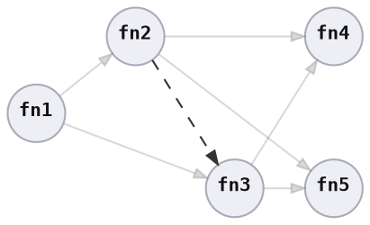

# Ordering

To define the order of execution, [`fn_graph`][`fn_graph`] uses two kinds of dependencies &ndash; logical and data. Logical dependencies are defined by consumers of the crate. Data dependencies are calculated by inspecting the type and mutability of function parameters.

Using the example:

```rust ,ignore
# type Fn1 = fn(&mut i32, &mut i32, &mut i32, &mut i32);
# type Fn2 = fn(&i32, &mut i32);
# type Fn3 = fn(&i32, &mut i32);
# type Fn4 = fn(&i32, &mut i32);
# type Fn5 = fn(&i32, &i32, &i32);
#
let fn1: Fn1 = |a, b, c, d| { *a = 1; *b = 2; *c = 0; *d = 0; };
let fn2: Fn2 = |a,    c   | *c += *a;
let fn3: Fn3 = |   b, c   | *c += *b;
let fn4: Fn4 = |      c, d| *d += *c;
let fn5: Fn5 = |a, b, c   | println!("{a} + {b} = {c}");
```

Even though it is possible to order these sequentially, we also want to be able to achieve concurrency to increase performance.

```dot process
digraph {
    graph [
        penwidth  = 0
        nodesep   = 0.5
        ranksep   = 0.4
        bgcolor   = "transparent"
        fontcolor = "#333333"
        splines   = line
        rankdir   = LR
    ]
    node [
        fontcolor = "#111111"
        fontname  = "monospace"
        fontsize  = 10
        shape     = "circle"
        style     = "filled"
        width     = 0.4
        height    = 0.4
        margin    = 0.04
        color     = "#aaaabb"
        fillcolor = "#eeeef5"
    ]
    edge [
        arrowsize = 0.7
        color     = "#333333"
        fontcolor = "#333333"
    ]

    fn1 [label = <<b>fn1</b>>]
    fn2 [label = <<b>fn2</b>>]
    fn3 [label = <<b>fn3</b>>]
    fn4 [label = <<b>fn4</b>>]
    fn5 [label = <<b>fn5</b>>]

    fn1 -> fn2 -> fn3 -> fn4 -> fn5
}
```




## Logical Dependencies

To encode this into a function graph, logical dependencies can be specified through edges:

```dot process
digraph {
    graph [
        penwidth  = 0
        nodesep   = 0.5
        ranksep   = 0.4
        bgcolor   = "transparent"
        fontcolor = "#333333"
        splines   = line
        rankdir   = LR
    ]
    node [
        fontcolor = "#111111"
        fontname  = "monospace"
        fontsize  = 10
        shape     = "circle"
        style     = "filled"
        width     = 0.4
        height    = 0.4
        margin    = 0.04
        color     = "#aaaabb"
        fillcolor = "#eeeef5"
    ]
    edge [
        arrowsize = 0.7
        color     = "#333333"
        fontcolor = "#333333"
    ]

    fn1 [label = <<b>fn1</b>>]
    fn2 [label = <<b>fn2</b>>]
    fn3 [label = <<b>fn3</b>>]
    fn4 [label = <<b>fn4</b>>]
    fn5 [label = <<b>fn5</b>>]

    fn1 -> fn2
    fn1 -> fn3
    fn2 -> fn4
    fn3 -> fn4
    fn2 -> fn5
    fn3 -> fn5
}
```



For correctness, `fn1` must be executed before both `fn2` and `fn3`, and those must complete before `fn4` and `fn5` are executed.


## Data Dependencies

Note that `fn4` and `fn5` can both be executed in parallel, as there is no overlap in accessed data.

However, `fn2` and `fn3` both require mutable access to `C`. Since it is not possible to safely provide both `fn2` and `fn3` with mutable access, `fn_graph` automatically introduces a data dependency between those functions to ensure consistent ordering:




[`fn_graph`]: https://github.com/azriel91/fn_graph
