# Value Specification

Item parameter values are eventually concrete values.

Some of those concrete values are not necessarily known until partway through a flow execution. When a flow is defined, a user needs a way to encode where a value comes from.

```dot process
digraph {
    graph [
        penwidth  = 0
        nodesep   = 0.0
        ranksep   = 0.8
        bgcolor   = "transparent"
        fontname  = "helvetica"
        fontcolor = "#7f7f7f"
        rankdir   = LR
    ]
    node [
        fontcolor = "#111111"
        fontname  = "monospace"
        fontsize  = 12
        shape     = "circle"
        style     = "filled"
        width     = 0.3
        height    = 0.3
        margin    = 0.04
        color     = "#9999aa"
        fillcolor = "#ddddf5"
    ]
    edge [
        arrowsize = 0.7
        color     = "#7f7f7f"
        fontcolor = "#7f7f7f"
    ]

    subgraph cluster_a {
        a [label = <<b>a</b>>]
        a_text [shape="plain" style="" fontcolor="#7f7f7f" label = <<table border="0" cellborder="0" cellpadding="0"><tr>
            <td><font point-size="15">⚙️</font></td>
            <td balign="left">app<br/>compile</td>
        </tr></table>>]

        a_params [
            margin   = 0.0
            fontsize = 10
            shape    = "none"
            style    = "filled,rounded"
            label    = <<table
                    style="rounded"
                    border="1"
                    cellborder="0"
                    cellpadding="1"
                    cellspacing="0"
                    bgcolor="#eeeef5"
                >
                <tr><td><font point-size="11"><b>Params</b></font></td></tr>
                <tr><td align="left" balign="left"><b>repo_path:</b></td></tr>
                <tr><td align="left" balign="left">/path/to/project</td></tr>
                <tr><td cellpadding="2"></td></tr>
            </table>>
        ]
    }
    subgraph cluster_b {
        margin = 0

        b [label = <<b>b</b>>]
        b_text [shape="plain" style="" fontcolor="#7f7f7f" label = <<table border="0" cellborder="0" cellpadding="0"><tr>
            <td><font point-size="15">🖥️</font></td>
            <td balign="left">server<br/>launch</td>
        </tr></table>>]

        b_params [
            margin   = 0.0
            fontsize = 10
            shape    = "none"
            style    = "filled,rounded"
            label    = <<table
                    style="rounded"
                    border="1"
                    cellborder="0"
                    cellpadding="1"
                    cellspacing="0"
                    bgcolor="#eeeef5"
                >
                <tr><td><font point-size="11"><b>Params</b></font></td></tr>
                <tr><td align="left" balign="left"><b>image_id:</b></td></tr>
                <tr><td align="left" balign="left">abcd1234</td></tr>
                <tr><td cellpadding="2"></td></tr>
                <tr><td align="left" balign="left"><b>instance_size:</b></td></tr>
                <tr><td align="left" balign="left">large</td></tr>
                <tr><td cellpadding="2"></td></tr>
            </table>>
        ]
    }
    subgraph cluster_c {
        c [label = <<b>c</b>>]
        c_text [shape="plain" style="" fontcolor="#7f7f7f" label = <<table border="0" cellborder="0" cellpadding="0"><tr>
            <td><font point-size="15">📤</font></td>
            <td balign="left">file<br/>upload</td>
        </tr></table>>]

        c_params [
            margin   = 0.0
            fontsize = 10
            shape    = "none"
            style    = "filled,rounded"
            label    = <<table
                    style="rounded"
                    border="1"
                    cellborder="0"
                    cellpadding="1"
                    cellspacing="0"
                    bgcolor="#eeeef5"
                >
                <tr><td><font point-size="11"><b>Params</b></font></td></tr>
                <tr><td align="left" balign="left"><b>src:</b></td></tr>
                <tr><td align="left" balign="left">/path/to/app</td></tr>
                <tr><td cellpadding="2"></td></tr>
                <tr><td align="left" balign="left"><b>dest:</b></td></tr>
                <tr><td align="left" balign="left">user@ip:/path/to/dest</td></tr>
                <tr><td cellpadding="2"></td></tr>
            </table>>
        ]
    }

    a -> b
    b -> c
}
```




## Plain Values

Plain values are values that a user provides before a command is executed.

```dot process
digraph {
    graph [
        penwidth  = 0
        nodesep   = 0.0
        ranksep   = 0.8
        bgcolor   = "transparent"
        fontname  = "helvetica"
        fontcolor = "#7f7f7f"
        rankdir   = LR
    ]
    node [
        fontcolor = "#111111"
        fontname  = "monospace"
        fontsize  = 12
        shape     = "circle"
        style     = "filled"
        width     = 0.3
        height    = 0.3
        margin    = 0.04
        color     = "#9999aa"
        fillcolor = "#ddddf5"
    ]
    edge [
        arrowsize = 0.7
        color     = "#7f7f7f"
        fontcolor = "#7f7f7f"
    ]

    subgraph cluster_a {
        a [label = <<b>a</b>>]
        a_text [shape="plain" style="" fontcolor="#7f7f7f" label = <<table border="0" cellborder="0" cellpadding="0"><tr>
            <td><font point-size="15">⚙️</font></td>
            <td balign="left">app<br/>compile</td>
        </tr></table>>]

        a_params [
            margin   = 0.0
            fontsize = 10
            shape    = "none"
            style    = "filled,rounded"
            label    = <<table
                    style="rounded"
                    border="1"
                    cellborder="0"
                    cellpadding="1"
                    cellspacing="0"
                    bgcolor="#eeeef5"
                >
                <tr><td><font point-size="11"><b>Params</b></font></td></tr>
                <tr><td align="left" balign="left"><font color="#003fcf"><b>repo_path:</b></font></td></tr>
                <tr><td align="left" balign="left">/path/to/project</td></tr>
                <tr><td cellpadding="2"></td></tr>
            </table>>
        ]
    }
    subgraph cluster_b {
        margin = 0

        b [label = <<b>b</b>>]
        b_text [shape="plain" style="" fontcolor="#7f7f7f" label = <<table border="0" cellborder="0" cellpadding="0"><tr>
            <td><font point-size="15">🖥️</font></td>
            <td balign="left">server<br/>launch</td>
        </tr></table>>]

        b_params [
            margin   = 0.0
            fontsize = 10
            shape    = "none"
            style    = "filled,rounded"
            label    = <<table
                    style="rounded"
                    border="1"
                    cellborder="0"
                    cellpadding="1"
                    cellspacing="0"
                    bgcolor="#eeeef5"
                >
                <tr><td><font point-size="11"><b>Params</b></font></td></tr>
                <tr><td align="left" balign="left"><font color="#003fcf"><b>image_id:</b></font></td></tr>
                <tr><td align="left" balign="left">abcd1234</td></tr>
                <tr><td cellpadding="2"></td></tr>
                <tr><td align="left" balign="left"><font color="#003fcf"><b>instance_size:</b></font></td></tr>
                <tr><td align="left" balign="left">large</td></tr>
                <tr><td cellpadding="2"></td></tr>
            </table>>
        ]
    }
    subgraph cluster_c {
        c [label = <<b>c</b>>]
        c_text [shape="plain" style="" fontcolor="#7f7f7f" label = <<table border="0" cellborder="0" cellpadding="0"><tr>
            <td><font point-size="15">📤</font></td>
            <td balign="left">file<br/>upload</td>
        </tr></table>>]

        c_params [
            margin   = 0.0
            fontsize = 10
            shape    = "none"
            style    = "filled,rounded"
            label    = <<table
                    style="rounded"
                    border="1"
                    cellborder="0"
                    cellpadding="1"
                    cellspacing="0"
                    bgcolor="#eeeef5"
                >
                <tr><td><font point-size="11"><b>Params</b></font></td></tr>
                <tr><td align="left" balign="left"><font color="#0000005f"><b>src:</b></font></td></tr>
                <tr><td align="left" balign="left"><font color="#0000005f">/path/to/app</font></td></tr>
                <tr><td cellpadding="2"></td></tr>
                <tr><td align="left" balign="left"><font color="#0000005f"><b>dest:</b></font></td></tr>
                <tr><td align="left" balign="left"><font color="#0000005f">user@ip:/path/to/dest</font></td></tr>
                <tr><td cellpadding="2"></td></tr>
            </table>>
        ]
    }

    a -> b
    b -> c
}
```



A variation of plain values is to provide a lookup function that is evaluated at the point the value is needed, but that has potential negative effects for user experience:

* **Performance:** Web service call(s) may take seconds to complete.
* **Consistency:** Multiple executions may discover different values between different command executions.

In code, this may look like:

```rust ,ignore
let app_params_spec = AppParams::spec()
    .repo_path(Path::from("/path/to/project"))
    .build();
let server_params_spec = ServerParams::spec()
    .image_id(image_id!("abcd1234"))
    .instance_size(InstanceSize::Large)
    .build();

cmd_ctx_builder
    .with_item_params(app_params_spec)
    .with_item_params(server_params_spec)
    .await?;
```


## Referenced Values

Referenced values are values directly taken from a predecessor's state output.

```dot process
digraph {
    graph [
        penwidth  = 0
        nodesep   = 0.0
        ranksep   = 0.8
        bgcolor   = "transparent"
        fontname  = "helvetica"
        fontcolor = "#7f7f7f"
        rankdir   = LR
    ]
    node [
        fontcolor = "#111111"
        fontname  = "monospace"
        fontsize  = 12
        shape     = "circle"
        style     = "filled"
        width     = 0.3
        height    = 0.3
        margin    = 0.04
        color     = "#9999aa"
        fillcolor = "#ddddf5"
    ]
    edge [
        arrowsize = 0.7
        color     = "#7f7f7f"
        fontcolor = "#7f7f7f"
    ]

    subgraph cluster_a {
        a [label = <<b>a</b>>]
        a_text [shape="plain" style="" fontcolor="#7f7f7f" label = <<table border="0" cellborder="0" cellpadding="0"><tr>
            <td><font point-size="15">⚙️</font></td>
            <td balign="left">app<br/>compile</td>
        </tr></table>>]

        a_params [
            margin   = 0.0
            fontsize = 10
            shape    = "none"
            style    = "filled,rounded"
            label    = <<table
                    style="rounded"
                    border="1"
                    cellborder="0"
                    cellpadding="1"
                    cellspacing="0"
                    bgcolor="#eeeef5"
                >
                <tr><td><font point-size="11"><b>Params</b></font></td></tr>
                <tr><td align="left" balign="left"><font color="#0000005f"><b>repo_path:</b></font></td></tr>
                <tr><td align="left" balign="left"><font color="#0000005f">/path/to/project</font></td></tr>
                <tr><td cellpadding="2"></td></tr>
            </table>>
        ]
    }
    subgraph cluster_b {
        margin = 0

        b [label = <<b>b</b>>]
        b_text [shape="plain" style="" fontcolor="#7f7f7f" label = <<table border="0" cellborder="0" cellpadding="0"><tr>
            <td><font point-size="15">🖥️</font></td>
            <td balign="left">server<br/>launch</td>
        </tr></table>>]

        b_params [
            margin   = 0.0
            fontsize = 10
            shape    = "none"
            style    = "filled,rounded"
            label    = <<table
                    style="rounded"
                    border="1"
                    cellborder="0"
                    cellpadding="1"
                    cellspacing="0"
                    bgcolor="#eeeef5"
                >
                <tr><td><font point-size="11"><b>Params</b></font></td></tr>
                <tr><td align="left" balign="left"><font color="#0000005f"><b>image_id:</b></font></td></tr>
                <tr><td align="left" balign="left"><font color="#0000005f">abcd1234</font></td></tr>
                <tr><td cellpadding="2"></td></tr>
                <tr><td align="left" balign="left"><font color="#0000005f"><b>instance_size:</b></font></td></tr>
                <tr><td align="left" balign="left"><font color="#0000005f">large</font></td></tr>
                <tr><td cellpadding="2"></td></tr>
            </table>>
        ]
    }
    subgraph cluster_c {
        c [label = <<b>c</b>>]
        c_text [shape="plain" style="" fontcolor="#7f7f7f" label = <<table border="0" cellborder="0" cellpadding="0"><tr>
            <td><font point-size="15">📤</font></td>
            <td balign="left">file<br/>upload</td>
        </tr></table>>]

        c_params [
            margin   = 0.0
            fontsize = 10
            shape    = "none"
            style    = "filled,rounded"
            label    = <<table
                    style="rounded"
                    border="1"
                    cellborder="0"
                    cellpadding="1"
                    cellspacing="0"
                    bgcolor="#eeeef5"
                >
                <tr><td><font point-size="11"><b>Params</b></font></td></tr>
                <tr><td align="left" balign="left"><font color="#003fcf"><b>src:</b></font></td></tr>
                <tr><td align="left" balign="left"><font color="#3f00cf">${app_path}</font></td></tr>
                <tr><td cellpadding="2"></td></tr>
                <tr><td align="left" balign="left"><font color="#0000005f"><b>dest:</b></font></td></tr>
                <tr><td align="left" balign="left"><font color="#0000005f">user@ip:/path/to/dest</font></td></tr>
                <tr><td cellpadding="2"></td></tr>
            </table>>
        ]
    }

    a -> b [weight = 3]
    b -> c [weight = 3]

    a_state [
        margin   = 0.0
        fontsize = 10
        shape    = "none"
        style    = "filled,rounded"
        label    = <<table
                style="rounded"
                border="1"
                cellborder="0"
                cellpadding="1"
                cellspacing="0"
                bgcolor="#eeeef5"
            >
            <tr><td><font point-size="11"><b>State</b></font></td></tr>
            <tr><td align="left" balign="left"><b>app_path:</b></td></tr>
            <tr><td align="left" balign="left">target/debug/app</td></tr>
            <tr><td cellpadding="2"></td></tr>
        </table>>
    ]

    a_state -> c_params [color="#3f00cf", minlen=2]
}
```



In code, this may look like:

```rust ,ignore
let file_upload_params_spec = FileUploadParams::spec()
    .src_from::<AppOutputPath>()
    // ..
    .build();

cmd_ctx_builder
    .with_item_params(file_upload_params_spec)
    .await?;
```


## Transformed Values

```dot process
digraph {
    graph [
        penwidth  = 0
        nodesep   = 0.0
        ranksep   = 0.8
        bgcolor   = "transparent"
        fontname  = "helvetica"
        fontcolor = "#7f7f7f"
        rankdir   = LR
    ]
    node [
        fontcolor = "#111111"
        fontname  = "monospace"
        fontsize  = 12
        shape     = "circle"
        style     = "filled"
        width     = 0.3
        height    = 0.3
        margin    = 0.04
        color     = "#9999aa"
        fillcolor = "#ddddf5"
    ]
    edge [
        arrowsize = 0.7
        color     = "#7f7f7f"
        fontcolor = "#7f7f7f"
    ]

    subgraph cluster_a {
        a [label = <<b>a</b>>]
        a_text [shape="plain" style="" fontcolor="#7f7f7f" label = <<table border="0" cellborder="0" cellpadding="0"><tr>
            <td><font point-size="15">⚙️</font></td>
            <td balign="left">app<br/>compile</td>
        </tr></table>>]

        a_params [
            margin   = 0.0
            fontsize = 10
            shape    = "none"
            style    = "filled,rounded"
            label    = <<table
                    style="rounded"
                    border="1"
                    cellborder="0"
                    cellpadding="1"
                    cellspacing="0"
                    bgcolor="#eeeef5"
                >
                <tr><td><font point-size="11"><b>Params</b></font></td></tr>
                <tr><td align="left" balign="left"><font color="#0000005f"><b>repo_path:</b></font></td></tr>
                <tr><td align="left" balign="left"><font color="#0000005f">/path/to/project</font></td></tr>
                <tr><td cellpadding="2"></td></tr>
            </table>>
        ]
    }
    subgraph cluster_b {
        margin = 0

        b [label = <<b>b</b>>]
        b_text [shape="plain" style="" fontcolor="#7f7f7f" label = <<table border="0" cellborder="0" cellpadding="0"><tr>
            <td><font point-size="15">🖥️</font></td>
            <td balign="left">server<br/>launch</td>
        </tr></table>>]

        b_params [
            margin   = 0.0
            fontsize = 10
            shape    = "none"
            style    = "filled,rounded"
            label    = <<table
                    style="rounded"
                    border="1"
                    cellborder="0"
                    cellpadding="1"
                    cellspacing="0"
                    bgcolor="#eeeef5"
                >
                <tr><td><font point-size="11"><b>Params</b></font></td></tr>
                <tr><td align="left" balign="left"><font color="#0000005f"><b>image_id:</b></font></td></tr>
                <tr><td align="left" balign="left"><font color="#0000005f">abcd1234</font></td></tr>
                <tr><td cellpadding="2"></td></tr>
                <tr><td align="left" balign="left"><font color="#0000005f"><b>instance_size:</b></font></td></tr>
                <tr><td align="left" balign="left"><font color="#0000005f">large</font></td></tr>
                <tr><td cellpadding="2"></td></tr>
            </table>>
        ]
    }
    subgraph cluster_c {
        c [label = <<b>c</b>>]
        c_text [shape="plain" style="" fontcolor="#7f7f7f" label = <<table border="0" cellborder="0" cellpadding="0"><tr>
            <td><font point-size="15">📤</font></td>
            <td balign="left">file<br/>upload</td>
        </tr></table>>]

        c_params [
            margin   = 0.0
            fontsize = 10
            shape    = "none"
            style    = "filled,rounded"
            label    = <<table
                    style="rounded"
                    border="1"
                    cellborder="0"
                    cellpadding="1"
                    cellspacing="0"
                    bgcolor="#eeeef5"
                >
                <tr><td><font point-size="11"><b>Params</b></font></td></tr>
                <tr><td align="left" balign="left"><font color="#0000005f"><b>src:</b></font></td></tr>
                <tr><td align="left" balign="left"><font color="#0000005f">${app_path}</font></td></tr>
                <tr><td cellpadding="2"></td></tr>
                <tr><td align="left" balign="left"><font color="#003fcf"><b>dest:</b></font></td></tr>
                <tr><td align="left" balign="left">user@<font color="#3f00cf">${server.ip}</font>:/path/to/dest</td></tr>
                <tr><td cellpadding="2"></td></tr>
            </table>>
        ]
    }

    a -> b [weight = 3]
    b -> c [weight = 3]

    b_state [
        margin   = 0.0
        fontsize = 10
        shape    = "none"
        style    = "filled,rounded"
        label    = <<table
                style="rounded"
                border="1"
                cellborder="0"
                cellpadding="1"
                cellspacing="0"
                bgcolor="#eeeef5"
            >
            <tr><td><font point-size="11"><b>State</b></font></td></tr>
            <tr><td align="left" balign="left"><b>ip:</b></td></tr>
            <tr><td align="left" balign="left">192.168.0.100</td></tr>
            <tr><td cellpadding="2"></td></tr>
        </table>>
    ]

    a_params -> b_state [style = "invis"]
    b_state -> c_params [color="#3f00cf"]
}
```




In code, this may look like:

```rust ,ignore
let file_upload_params_spec = FileUploadParams::spec()
    // ..
    .dest_from_map::<Server>(|server| {
        let ip = server.ip();
        format!("user@${ip}:/path/to/dest")
    })
    .build();

cmd_ctx_builder
    .with_item_params(file_upload_params_spec)
    .await?;
```
