# Item Spec Parameters

For an item spec to work with different values, the values must be passed in. These values are called item spec parameters.

```dot process
digraph {
    graph [
        penwidth  = 0
        nodesep   = 0.0
        ranksep   = 0.8
        bgcolor   = "transparent"
        fontname  = "helvetica"
        fontcolor = "#7f7f7f"
        rankdir   = LR
    ]
    node [
        fontcolor = "#111111"
        fontname  = "monospace"
        fontsize  = 12
        shape     = "circle"
        style     = "filled"
        width     = 0.3
        height    = 0.3
        margin    = 0.04
        color     = "#9999aa"
        fillcolor = "#ddddf5"
    ]
    edge [
        arrowsize = 0.7
        color     = "#7f7f7f"
        fontcolor = "#7f7f7f"
    ]

    subgraph cluster_a {
        a [label = <<b>a</b>>]
        a_text [shape="plain" style="" fontcolor="#7f7f7f" label = <app<br/>compile>]

        a_params [
            margin   = 0.0
            fontsize = 10
            shape    = "none"
            style    = "filled,rounded"
            label    = <<table
                    style="rounded"
                    border="1"
                    cellborder="0"
                    cellpadding="1"
                    cellspacing="0"
                    bgcolor="#eeeef5"
                >
                <tr><td><font point-size="11"><b>Params</b></font></td></tr>
                <tr><td align="left" balign="left"><b>repo_path:</b></td></tr>
                <tr><td align="left" balign="left">/path/to/project</td></tr>
                <tr><td cellpadding="2"></td></tr>
            </table>>
        ]
    }
    subgraph cluster_b {
        margin = 0

        b [label = <<b>b</b>>]
        b_text [shape="plain" style="" fontcolor="#7f7f7f" label = <server<br/>launch>]

        b_params [
            margin   = 0.0
            fontsize = 10
            shape    = "none"
            style    = "filled,rounded"
            label    = <<table
                    style="rounded"
                    border="1"
                    cellborder="0"
                    cellpadding="1"
                    cellspacing="0"
                    bgcolor="#eeeef5"
                >
                <tr><td><font point-size="11"><b>Params</b></font></td></tr>
                <tr><td align="left" balign="left"><b>image_id:</b></td></tr>
                <tr><td align="left" balign="left">abcd1234</td></tr>
                <tr><td cellpadding="2"></td></tr>
                <tr><td align="left" balign="left"><b>instance_size:</b></td></tr>
                <tr><td align="left" balign="left">large</td></tr>
                <tr><td cellpadding="2"></td></tr>
            </table>>
        ]
    }
    subgraph cluster_c {
        c [label = <<b>c</b>>]
        c_text [shape="plain" style="" fontcolor="#7f7f7f" label = <file<br/>upload>]

        c_params [
            margin   = 0.0
            fontsize = 10
            shape    = "none"
            style    = "filled,rounded"
            label    = <<table
                    style="rounded"
                    border="1"
                    cellborder="0"
                    cellpadding="1"
                    cellspacing="0"
                    bgcolor="#eeeef5"
                >
                <tr><td><font point-size="11"><b>Params</b></font></td></tr>
                <tr><td align="left" balign="left"><b>src:</b></td></tr>
                <tr><td align="left" balign="left">/path/to/app</td></tr>
                <tr><td cellpadding="2"></td></tr>
                <tr><td align="left" balign="left"><b>dest:</b></td></tr>
                <tr><td align="left" balign="left">user@ip:/path/to/dest</td></tr>
                <tr><td cellpadding="2"></td></tr>
            </table>>
        ]
    }

    a -> b
    b -> c
}
```

There are a number of related concepts:

* User needs to be able to specify how the *values* are defined:

    - **Plain Values:** Use a value provided by the user.
    - **Referenced Values:** Use a value produced by a predecessor item spec.
    - **Transformed Values:** Take values produced by predecessor item spec(s), transform it, then use that.

* Implementors:

    - Need to define the parameters.
    - Take in parameter values for `state_current`, `state_desired`.
    - Take in `Option<Field>` for each field within the parameter for `try_state_current`, `try_state_desired`.

* Peace should be able to store and load:

    - The specification by the user.
    - The actual values computed and used during command execution.
