# Item Spec Graph

An item spec graph is a [function graph], whose logic type is an [item spec].

Instead of storing a single function in each node of the graph, each logic type is a collection of well-defined functions adhering to the [`ItemSpec`][`ItemSpec`] trait. <!-- Items that build upon other items are ordered through graph dependencies. -->

Combining these concepts contributes to the [strategy]'s outcomes, by enabling the framework to address common issues in each input dimension.

```dot process
digraph {
    graph [
        penwidth  = 0
        nodesep   = 0.25
        ranksep   = 0.3
        bgcolor   = "transparent"
        fontcolor = "#555555"
        splines   = line
    ]
    node [
        fontcolor = "#111111"
        fontname  = "monospace"
        fontsize  = 10
        shape     = "circle"
        style     = "filled"
        width     = 0.4
        height    = 0.4
        margin    = 0.04
        color     = "#aaaabb"
        fillcolor = "#eeeef5"
    ]
    edge [
        arrowsize = 0.7
        color     = "#555555"
        fontcolor = "#555555"
    ]

    fn1 [label = <<b>fn1</b>>]
    fn2 [label = <<b>fn2</b>>]
    fn3 [label = <<b>fn3</b>>]
    fn4 [label = <<b>fn4</b>>]

    fn1 -> fn3
    fn2 -> fn3
    fn2 -> fn4 [weight = 2]
    fn3 -> fn4 [style = "dashed", color = "#555555"]
}
```

<div style="display: inline-block; padding: 0px 20px 0px 0px;">



</div>
<div style="display: inline-block; vertical-align: top;">

```rust ,ignore
let graph = {
    let mut graph_builder = ItemSpecGraphBuilder::<XError>::new();
    let [id_1, id_2, id_3, id_4] = graph_builder.add_fns([
        ItemSpec1::new(param1).into(),
        ItemSpec2::new(/* .. */).into(),
        ItemSpec3::new().into(),
        ItemSpec4::new().into(),
    ]);
    graph_builder.add_edges([
        (id_1, id_3),
        (id_2, id_3),
        (id_2, id_4),
    ])?;

    graph_builder.build()
};
```

</div>

The remainder of this section explains how using these concepts together allows sensible user facing commands to be created. Available [commands] are documented in the [reference].


[`ItemSpec`]: https://docs.rs/peace_cfg/latest/peace_cfg/trait.ItemSpec.html
[commands]: ../reference/commands.html
[function graph]: function_graph.html
[item spec]: item_spec.html
[reference]: ../reference.html
[strategy]: ../background/strategy.html
