```dot process
digraph {
    graph [
        penwidth  = 0
        nodesep   = 0.25
        ranksep   = 0.3
        bgcolor   = "transparent"
        fontcolor = "#555555"
        splines   = line
    ]
    node [
        fontcolor = "#111111"
        fontname  = "monospace"
        fontsize  = 10
        shape     = "circle"
        style     = "filled"
        width     = 0.4
        height    = 0.4
        margin    = 0.04
        color     = "#aaaabb"
        fillcolor = "#eeeef5"
    ]
    edge [
        arrowsize = 0.7
        color     = "#555555"
        fontcolor = "#555555"
    ]

    fn1 [label = <<b>fn1</b>>, color = "#88bbff", fillcolor = "#bbddff"]
    fn2 [label = <<b>fn2</b>>]
    fn3 [label = <<b>fn3</b>>]
    fn4 [label = <<b>fn4</b>>]

    fn1 -> fn3
    fn2 -> fn3
    fn2 -> fn4 [weight = 2]
    fn3 -> fn4 [style = "dashed", color = "#555555"]
}
```

# Initialization

> Before a process is started, make sure all the necessary information is provided.

In function graph, data types in `Resources` are inserted by the consumer, separate from the graph.

In Peace, `ItemSpec::setup` is run for each item spec, which allows data types to be inserted into `Resources`.

```rust ,ignore
let graph = /* .. */;

let resources = graph.setup(Resources::new()).await?;
```

<div style="display: inline-block; padding: 0px 20px 0px 0px;">
<br />



</div>
<div style="display: inline-block; vertical-align: top;">

```rust ,ignore
// ItemSpec1::setup
resources.insert(param1);

// ItemSpec2::setup
resources.insert(param2);

// ItemSpec3::setup
// no-op

// ItemSpec4::setup
resources.insert(param3);
resources.insert(param4);
```

</div>

> ℹ️ **Note:** Each initialization parameter should be specified in each item spec's `setup` method, even though the parameter is inserted by a predecessor item spec.
>
> This is because when only a subset of the graph is executed, or if the item spec is used in a different graph, the parameter should still be inserted.
>
> *🚧 A wrapper type should conditionally insert the initialization parameter into `Resources`*

