# State Ensure

> When applying a change, the change should converge the current state to the desired state.

In Peace, 

```rust ,ignore
let graph = /* .. */;
let resources = /* .. */;

let resources = EnsureCmd::exec(graph, resources).await?;
```

Note that the `EnsureOpSpec::exec` requires implementers to return `StatePhysical`, which is the state information generated during the `exec` logic, but not necessarily within the implementers' control.


## Method

To discover the current state of all items, the following method is used:

1. `EnsureOpSpec::check` is run for all item specs.
2. Of the ones that return `OpCheckStatus::ExecRequired`, `EnsureOpSpec::exec` is run.
3. Finally, `StateCurrentFnSpec::exec` is run so that the end state can be compared with the desired state to confirm that they match.

### `EnsureOpSpec::check`

```dot process
digraph {
    graph [
        penwidth  = 0
        nodesep   = 0.25
        ranksep   = 0.3
        bgcolor   = "transparent"
        fontcolor = "#555555"
        splines   = line
    ]
    node [
        fontcolor = "#111111"
        fontname  = "monospace"
        fontsize  = 10
        shape     = "circle"
        style     = "filled"
        width     = 0.4
        height    = 0.4
        margin    = 0.04
        color     = "#aaaabb"
        fillcolor = "#eeeef5"
    ]
    edge [
        arrowsize = 0.7
        color     = "#555555"
        fontcolor = "#555555"
    ]

    fn1 [label = <<b>fn1</b>>, color = "#88bbff", fillcolor = "#bbddff"]
    fn2 [label = <<b>fn2</b>>, color = "#88bbff", fillcolor = "#bbddff"]
    fn3 [label = <<b>fn3</b>>]
    fn4 [label = <<b>fn4</b>>]

    fn1 -> fn3
    fn2 -> fn3
    fn2 -> fn4 [weight = 2]
    fn3 -> fn4 [style = "dashed", color = "#555555"]
}
```

<div style="display: inline-block; padding: 0px 20px 0px 0px;">
<br />



</div>
<div style="display: inline-block; vertical-align: top;">

```rust ,ignore
// ItemSpec1
OpCheckStatus::ExecRequired { .. }

// ItemSpec2
OpCheckStatus::ExecNotRequired

// ItemSpec3
OpCheckStatus::ExecRequired { .. }

// ItemSpec4
OpCheckStatus::ExecRequired { .. }
```

</div>


### `EnsureOpSpec::exec`

```dot process
digraph {
    graph [
        penwidth  = 0
        nodesep   = 0.25
        ranksep   = 0.3
        bgcolor   = "transparent"
        fontcolor = "#555555"
        splines   = line
    ]
    node [
        fontcolor = "#111111"
        fontname  = "monospace"
        fontsize  = 10
        shape     = "circle"
        style     = "filled"
        width     = 0.4
        height    = 0.4
        margin    = 0.04
        color     = "#aaaabb"
        fillcolor = "#eeeef5"
    ]
    edge [
        arrowsize = 0.7
        color     = "#555555"
        fontcolor = "#555555"
    ]

    fn1 [label = <<b>fn1</b>>, color = "#88ffbb", fillcolor = "#bbffdd"]
    fn2 [label = <<b>fn2</b>>, color = "#77eeaa", fillcolor = "#aaeecc"]
    fn3 [label = <<b>fn3</b>>, color = "#88bbff", fillcolor = "#bbddff"]
    fn4 [label = <<b>fn4</b>>, color = "#88bbff", fillcolor = "#bbddff"]

    fn1 -> fn3
    fn2 -> fn3
    fn2 -> fn4 [weight = 2]
    fn3 -> fn4 [style = "dashed", color = "#555555"]
}
```

<div style="display: inline-block; padding: 0px 20px 0px 0px;">
<br />



</div>
<div style="display: inline-block; width: 600px; vertical-align: top;">

Item specs 1, 3, and 4 need to be executed, but `ItemSpec2`'s `EnsureOpSpec::exec` is skipped as `check` indicated it isn't needed.

```rust ,ignore
// ItemSpec1
()

// ItemSpec2
IpAddr::from_str("1.2.3.4")

// ItemSpec3
()  // Note: version is logical state

// ItemSpec4
Revision::new("abcdef0123456")
```

</div>


## Dry Run

```rust ,ignore
let resources = EnsureDryCmd::exec(graph, resources).await?;
```

Similar to the `EnsureCmd`, the `EnsureDryCmd` is meant to simulate what *would* happen, and allow users to correct mistakes before actual execution.

Implementers must replace all *write* logic with mocks. These include:

* File writes
* Web requests

It is also recommended that *read* requests to external services are minimized to decrease the time to return feedback to the user. If possible, move read request logic to `StateCurrentFnSpec` so that it is stored by the `StatesDiscoverCmd`.


## Convergence / Non-Transactional Execution Recovery

Since these processes happen over distributed systems, and errors can happen at any point in the process, it is realistic to assume that the process doesn't happen transactionally.

`EnsureOpSpec` has been designed so that implementers will consider transitions from non-atomic states to the desired state. In simpler terms, if the desired state is "10 servers must exist", then:

* When the current state is 0 servers, then 10 servers should be launched.
* When the current state is 6 servers, then 4 servers should be launched.

As time and effort is saved by reusing existing useful state and not requiring complete clean up, recoverability and user experience is improved.

<!-- Executing a subset of the graph. Cleaning a subset, and re-ensuring from that point. -->
