```dot process
digraph {
    graph [
        penwidth  = 0
        nodesep   = 0.25
        ranksep   = 0.3
        bgcolor   = "transparent"
        fontcolor = "#555555"
        splines   = line
    ]
    node [
        fontcolor = "#111111"
        fontname  = "monospace"
        fontsize  = 10
        shape     = "circle"
        style     = "filled"
        width     = 0.4
        height    = 0.4
        margin    = 0.04
        color     = "#aaaabb"
        fillcolor = "#eeeef5"
    ]
    edge [
        arrowsize = 0.7
        color     = "#555555"
        fontcolor = "#555555"
    ]

    fn1 [label = <<b>fn1</b>>, color = "#88bbff", fillcolor = "#bbddff"]
    fn2 [label = <<b>fn2</b>>, color = "#88bbff", fillcolor = "#bbddff"]
    fn3 [label = <<b>fn3</b>>]
    fn4 [label = <<b>fn4</b>>]

    fn1 -> fn3
    fn2 -> fn3
    fn2 -> fn4 [weight = 2]
    fn3 -> fn4 [style = "dashed", color = "#555555"]
}
```

# State Inspection

> Before applying a change, you should understand the current state, and what the change will do.

To discover the current state of all items, `StateCurrentFnSpec::try_discover` is run for each item spec concurrently.

```rust ,ignore
let graph = /* .. */;
let resources = /* .. */;

let resources = StatesCurrentDiscoverCmd::exec(graph, resources).await?;
```

<div style="display: inline-block; padding: 0px 20px 0px 0px;">
<br />



</div>
<div style="display: inline-block; vertical-align: top;">

```rust ,ignore
// ItemSpec1::StateCurrentFnSpec::try_discover
let exists = param1.path().exists();
Ok(State::new(exists, ()))

// ItemSpec2::StateCurrentFnSpec::try_discover
let instance_url = discover(param2).await?;
Ok(State::new(Some(instance_url), ()))

// ItemSpec3::StateCurrentFnSpec::try_discover
let version = reqwest::get(instance_url).await?;
Ok(State::new(version, ()))

// ..
```

</div>

When all states have been collected, they are presented to the user:

```yaml
state1: exists
state2: 1.2.3.4
state3: 1.0.0
state4: abcdef0123456
```
