# Workspace

A tool built using the Peace framework must execute in a *workspace* &ndash; a location that Peace reads and writes information when commands are executed.

In a native automation tool, the workspace is usually the repository in which the automation is run, so the [workspace directory] is the repository root. In a WASM tool, Peace currently is able to store information in the browser `LocalStorage` or `SessionStorage`.


## Peace Data

The following shows the file structure for data stored by Peace.

#### Path Segments

```dot process
digraph {
    graph [
        splines = curved
        rankdir = LR
        ranksep = 0
        nodesep = 0.02
    ]

    node [
        fontcolor = "#111111"
        fontname  = "helvetica"
        fontsize  = 10
        shape     = "none"
        margin    = 0
        style     = "rounded"
        color     = "#aaaabb"
        height    = 1.5
        labelloc  = "t"
    ]
    edge [
        style = invis
    ]


    workspace_dir [
        label = <<table
                    style="rounded"
                    bgcolor="#eeeef5"
                    border="1"
                    cellborder="0"
                    cellpadding="0"
                    cellspacing="6"
                    valign="top">
                <tr>
                    <td align="left"><b>Workspace Dir</b></td>
                </tr>
                <tr>
                    <td>path&#47;to&#47;my_repo<br align="left"/></td>
                </tr>
            </table>>
    ]

    peace_dir [
        label = <<table
                    style="rounded"
                    bgcolor="#eeeef5"
                    border="1"
                    cellborder="0"
                    cellpadding="0"
                    cellspacing="6"
                    valign="top">
                <tr>
                    <td align="left"><b>Peace Dir</b></td>
                </tr>
                <tr>
                    <td align="left">.peace<br align="left"/></td>
                </tr>
            </table>>
    ]

    peace_app_dir [
        label = <<table
                    style="rounded"
                    bgcolor="#eeeef5"
                    border="1"
                    cellborder="0"
                    cellpadding="0"
                    cellspacing="6"
                    valign="top">
                <tr>
                    <td align="left"><b>Peace App Dir</b></td>
                </tr>
                <tr>
                    <td align="left">envman<br align="left"/></td>
                </tr>
            </table>>
    ]

    profile_dir [
        label = <<table
                    style="rounded"
                    bgcolor="#eeeef5"
                    border="1"
                    cellborder="0"
                    cellpadding="0"
                    cellspacing="6"
                    valign="top">
                <tr>
                    <td align="left"><b>🌏 Profile Dir</b></td>
                </tr>
                    <tr><td align="left">internal_dev_a<br align="left"/>
internal_dev_b<br align="left"/>
customer_a_dev<br align="left"/>
customer_a_prod<br align="left"/>
customer_b_dev<br align="left"/>
customer_b_prod<br align="left"/></td></tr>
            </table>>
    ]

    flow_dir [
        label = <<table
                    style="rounded"
                    bgcolor="#eeeef5"
                    border="1"
                    cellborder="0"
                    cellpadding="0"
                    cellspacing="6"
                    valign="top">
                <tr>
                    <td align="left"><b>🌊 Flow Dir</b></td>
                </tr>
                <tr><td align="left">deploy<br align="left"/>
config<br align="left"/>
benchmark<br align="left"/></td></tr>
            </table>>
    ]

    workspace_dir -> peace_dir
    peace_dir -> peace_app_dir
    peace_app_dir -> profile_dir
    profile_dir -> flow_dir
}
```




#### Hierarchy

```bash
$workspace_dir  # usually the project repository
|
|  # .peace, single directory to store data from tools made with Peace
|- $peace_dir
    |
    |  # directory per tool
    |- $peace_app_dir
        |- 📝 $workspace_params_file
        |
        |  # profile name, directory per profile
        |- 🌏 $profile_dir
            |- 📝 $profile_params_file
            |
            |  # flow name, directory per flow
            |- 🌊 $flow_dir
                |- 📝 $flow_params_file
                |- 📋 $states_current_file
                |- 📋 $states_goal_file
```

### Concrete Hierarchy Example

```bash
path/to/repo
|- .peace
    |- envman
        |- 📝 workspace_params.yaml
        |
        |- 🌏 internal_dev_a
        |   |- 📝 profile_params.yaml
        |   |
        |   |- 🌊 deploy
        |   |   |- 📝 flow_params.yaml
        |   |   |- 📋 states_goal.yaml
        |   |   |- 📋 states_current.yaml
        |   |
        |   |- 🌊 config
        |   |   |- 📝 flow_params.yaml
        |   |   |- 📋 states_goal.yaml
        |   |   |- 📋 states_current.yaml
        |   |
        |   |- 🌊 benchmark
        |       |- 📝 flow_params.yaml
        |       |- 📋 states_goal.yaml
        |       |- 📋 states_current.yaml
        |
        |- 🌏 customer_a_dev
        |   |- 📝 profile_params.yaml
        |   |
        |   |- 🌊 deploy - ..
        |   |- 🌊 config - ..
        |
        |- 🌏 customer_a_prod
            |- 📝 profile_params.yaml
            |
            |- 🌊 deploy - ..
            |- 🌊 config - ..
```


[workspace directory]: https://docs.rs/peace_resources/latest/peace_resources/paths/struct.WorkspaceDir.html
